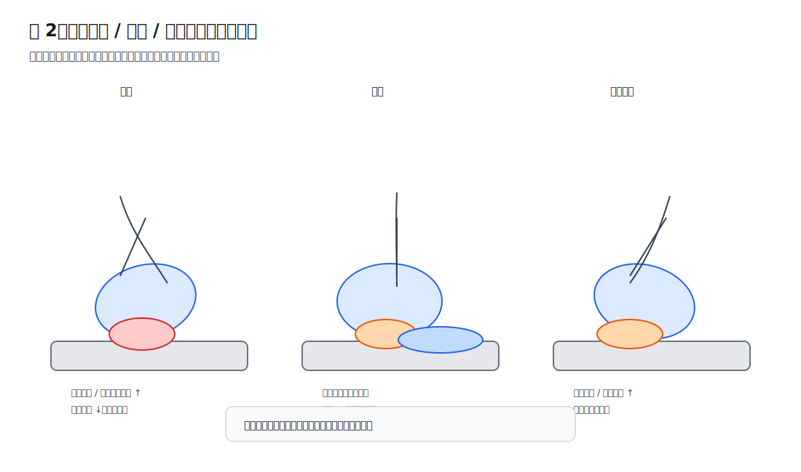
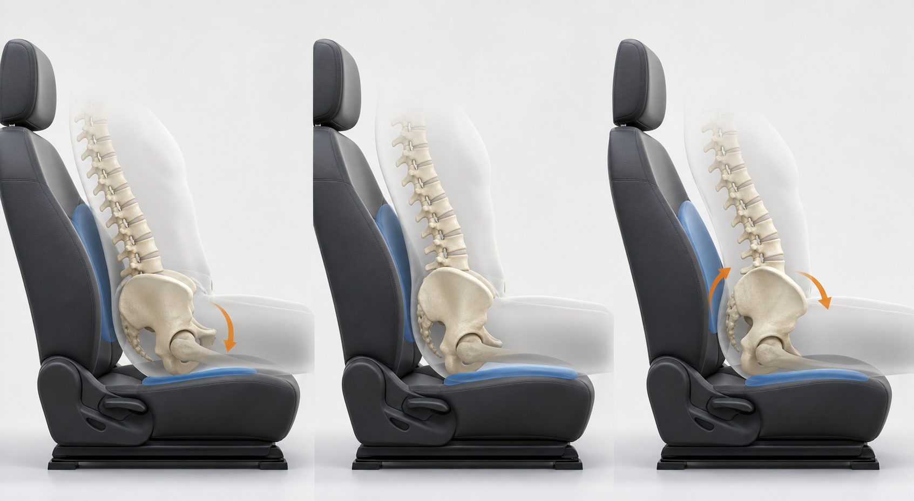

# 第二章 骨盆决定受力

> 本章核心观点：驾驶坐姿中，骨盆不是一个被动摆放的骨架，而是上半身重量、腰椎曲度、坐骨受力、大腿承重和踏板控制之间的“力学中转站”。大多数坐姿不适，最终都能回到骨盆位置上解释。

---

## 2.1 为什么骨盆是驾驶坐姿的核心

人在驾驶时，看似是“坐在座椅上”，实际上身体重量会沿着一条明确的路径传递：

```text
头部 / 胸廓 / 腹部
        ↓
      脊柱
        ↓
      骨盆
        ↓
坐骨 + 臀部软组织 + 大腿后侧
        ↓
      座椅
```

骨盆处在这条传力路径的中间。它上接脊柱，下接髋关节和大腿，同时又通过坐骨与座椅接触。因此，骨盆角度一变，至少会同时改变四件事：

1. **坐骨的实际受力部位**：压在坐骨结节正下方，还是偏向坐骨后缘、尾骨方向。
2. **大腿后侧是否参与承重**：大腿是被座椅托住，还是基本悬空，或者被前沿顶住。
3. **腰椎曲度是否自然**：腰椎是保持自然小弧，还是被压平，或者被迫过度前凸。
4. **右腿踩踏板时是否需要额外稳定**：骨盆不稳时，右腿不仅要踩踏板，还要参与稳定身体。

所以，很多人把问题理解成“座椅高低不合适”“靠背角度不合适”“大腿被压”，但更底层的问题常常是：

> **骨盆没有落在一个稳定、可持续、受力分散的位置。**

---

## 2.2 骨盆的三种典型姿态

驾驶坐姿中，骨盆可以简化为三种状态：

1. 骨盆后倾；
2. 骨盆中立；
3. 骨盆过度前倾。

这三种状态没有绝对的好坏。问题在于：哪一种能在驾驶这个特定场景下，长期保持较低的峰值压强和较小的肌肉代偿。



下图用更接近真实座椅的侧视场景表达同一件事：骨盆角度不是孤立变量，它会同时改变腰背贴合、坐骨落点和大腿承托。



---

## 2.3 骨盆后倾：最常见，也最容易造成坐骨后缘压力

骨盆后倾时，身体通常表现为：

- 腰椎变平；
- 胸口略塌；
- 身体像“窝”在座椅里；
- 臀部向前滑或向后瘫；
- 坐骨受力偏向后方；
- 大腿后侧分担减少；
- 尾骨方向压力增加。

简化侧视图：

```text
骨盆后倾

    胸背
      \\
       \\
        \\____
        骨盆向后卷

受力特点：
坐骨后缘 ↑↑↑
尾骨方向 ↑
大腿分担 ↓
腰椎曲度 ↓
```

后倾不是“坐骨不承重”，而是坐骨承重的位置偏后了。坐骨结节本来就是坐姿下合理的骨性承重点，但当骨盆后倾时，压力容易从坐骨结节正下方滑向：

- 坐骨后缘；
- 尾骨方向；
- 臀部较薄软组织区域。

这些地方软组织覆盖相对薄，耐压能力更差，因此更容易出现坐骨后方疼、尾骨附近不舒服、一坐久就出现局部硬点、下车后短时间缓解。

从压力分布看，后倾状态常见的问题是：

```text
合理分散：
臀部 + 坐骨 + 大腿后侧

后倾集中：
坐骨后缘 + 尾骨方向
```

也就是说，后倾不一定马上疼，但它会提高局部峰值压强，让疼痛更容易在 20 到 60 分钟内累积出来。

---

## 2.4 骨盆中立：驾驶坐姿的目标区间

骨盆中立并不是一个精确到某个角度的点，而是一个区间。它的特点是：

- 腰椎有自然小弧；
- 坐骨正下方有稳定承重；
- 臀部和大腿后侧共同分担重量；
- 上身可以被靠背接住；
- 不需要刻意挺腰；
- 右脚踩踏板时身体不会随之晃动。

简化侧视图：

```text
骨盆中立

    胸背
      |
      |
   ___|___
   骨盆稳定

受力特点：
坐骨结节正下方 ↑↑
臀部软组织 ↑↑
大腿后侧 ↑
尾骨方向 ↓
腰椎自然小弧
```

中立坐姿的关键不是“坐得很直”，而是：

> **骨盆稳定，脊柱自然，压力分散。**

很多人误以为人体工程学坐姿应该像军姿一样挺拔。实际上，驾驶坐姿不要求胸部刻意抬高，也不要求腰背持续用力。真正合理的状态是：

- 身体被座椅支撑；
- 背部可以贴合靠背；
- 腰部不是被硬顶，而是被接住；
- 肩膀自然下沉；
- 手臂轻松够到方向盘；
- 坐骨有承重，但不是尖锐的单点压痛。

---

## 2.5 过度前倾：不是后倾的反义词，也不是越前倾越好

有些人在意识到自己后倾后，会刻意挺腰、撅臀，让骨盆大幅前倾。这样短时间可能感觉“坐正了”，但长时间驾驶并不理想。

过度前倾常见表现：

- 腰椎过度前凸；
- 腰背肌持续紧张；
- 腹部向前顶；
- 髋前侧紧；
- 臀部后上方紧；
- 右腿踩踏板时髋部不放松。

所以，本书不建议追求“明显前倾”。目标是：

> **中立到轻微前倾，而不是用力挺腰。**

对于驾驶而言，骨盆过度前倾和骨盆后倾一样，都可能造成新的不适。前者更多表现为腰背劳损、髋前侧紧张；后者更多表现为坐骨后缘压痛、尾骨方向不适、大腿分担不足。

---

## 2.6 “蜷缩在座椅里”到底对不对

驾驶者经常会说：

> “我现在像是整个人蜷缩在座椅里。”

这句话本身不能判断对错。必须区分两种情况。

### 第一种：合理包裹

如果满足以下条件，这种“蜷缩”更接近合理包裹：

- 臀部坐到座椅深处；
- 腰和靠背基本贴合；
- 肩膀也能自然接触靠背；
- 胸部没有明显塌陷；
- 下巴没有明显前伸；
- 坐骨承重稳定；
- 大腿后侧有承托；
- 不需要用腹部或腰背持续发力维持姿势。

这种状态看起来不一定很挺拔，但它是放松且被支撑的。

### 第二种：错误塌陷

如果出现以下情况，就是不良蜷缩：

- 骨盆明显后卷；
- 腰椎完全变平；
- 胸口塌陷；
- 下巴前伸；
- 方向盘距离太远，肩膀被拉走；
- 坐骨后缘或尾骨方向疼；
- 大腿后侧不参与分担；
- 开久后身体慢慢向前滑。

因此，判断姿势是否合理，不应只看“直不直”，而要看：

> **骨盆是否稳定，腰背是否自然被接住，压力是否分散。**

---

## 2.7 靠背角度如何影响骨盆

靠背角度是影响骨盆的重要变量。

### 靠背太躺

靠背太躺时，身体容易向后下方滑移。此时骨盆很容易后倾，坐骨压力偏向后缘。表现为：

- 坐着像躺着；
- 腰椎变平；
- 尾骨方向压力增加；
- 踩踏板时右腿需要更多稳定；
- 长时间后坐骨后方更容易疼。

### 靠背太直

靠背太直时，问题可能反过来：

- 身体需要主动维持；
- 腰背肌持续紧张；
- 肩颈不容易放松；
- 如果方向盘没拉近，身体会前探；
- 如果腰托过强，可能把骨盆向前推。

### 合理靠背

合理靠背不是一个绝对角度，而是满足以下条件：

- 背部能自然贴合；
- 肩膀不用离开靠背去够方向盘；
- 腰部有支撑但不被顶；
- 骨盆不后倒；
- 坐骨不出现后缘压痛；
- 右腿踩踏板时身体不跟着晃。

对于很多驾驶者，靠背略直比过度后躺更容易维持骨盆中立。但“略直”不等于垂直，也不等于需要持续挺腰。

---

## 2.8 腰托的作用：接住，而不是硬顶

腰托经常被误用。正确顺序应该是：

```text
先把骨盆摆到接近中立
↓
腰椎出现自然小弧
↓
再让腰托接住这个小弧
```

错误顺序是：

```text
骨盆仍然后倾
↓
直接把腰托打满
↓
腰托顶不进腰窝
↓
整个人被往前推
```

如果驾驶者本身腰背较平、骨盆后倾明显，原厂气囊腰托可能会出现一个问题：

> 它不是填进腰窝，而是顶住整个腰背，把身体往前推。

这时大腿根部压力、坐骨侧边挤压、身体前滑感都可能增加。

因此，腰托不是解决骨盆问题的主力。它只能在骨盆已经接近合理位置时，提供辅助支撑。

---

## 2.9 座椅高度如何影响骨盆

座椅高度改变的是髋关节与膝关节的相对位置。

### 座椅偏低

常见影响：

- 髋关节低于膝关节；
- 大腿相对抬高；
- 骨盆更容易后倾；
- 坐骨后缘压力增加；
- 大腿根或髋部空间变小；
- 踩踏板时腿部角度受限。

### 座椅适当升高

可能带来：

- 髋部略高于膝部；
- 骨盆更容易回到中立；
- 大腿后侧参与承重；
- 坐骨峰值压强下降；
- 坐骨两侧软组织挤压可能减轻。

### 座椅过高

可能带来：

- 大腿后侧持续受压；
- 腘窝或神经血管受压风险增加；
- 脚跟支点不稳定；
- 踩踏板需要更多脚踝或小腿代偿；
- 大腿后侧出现紧、硬、麻、刺。

所以，座椅高度不是越高越好。它有一个目标区间：

> **髋部略高或接近膝部，大腿有承托，脚跟能稳定落地，踩刹车到底时膝盖仍保留弯曲。**

---

## 2.10 前沿高度如何影响骨盆和大腿

前沿高度主要影响大腿后侧接触面积。

适当抬高前沿时：

- 大腿后侧接触增加；
- 坐骨单点压强下降；
- 大腿与坐垫接触更连续；
- 臀部不再只靠坐骨局部承重。

但前沿过高时：

- 大腿根压力可能明显；
- 大腿后侧持续紧硬；
- 腘窝方向压力增加；
- 右腿踩踏板更累；
- 大腿后侧可能出现麻刺。

因此，前沿高度的目标不是“越托越好”，而是：

> **让大腿参与分担坐骨压力，但不形成新的大腿后侧压迫。**

---

## 2.11 骨盆中立的自测方法

### 方法一：硬椅坐骨感知

坐在较硬的椅子上，双手垫在臀下，摸到两块坐骨。

然后做小幅骨盆前后摆动：

1. 骨盆向后卷：感觉坐骨往后滚，腰椎变平；
2. 骨盆向前转：感觉腰明显挺起，坐骨位置前移；
3. 在两者中间找到一个不用力的位置。

目标感觉：

- 两块坐骨正下方稳定；
- 腰部有自然小弧；
- 不需要挺胸；
- 呼吸自然；
- 臀部不是夹紧状态。

### 方法二：车内停车自测

车辆静止时，坐好后双手轻轻离开方向盘。观察：

- 身体是否自然被靠背接住；
- 是否会向前塌；
- 是否需要腹肌持续用力；
- 腰背是否能保持自然接触；
- 坐骨是否出现后方压痛。

如果一离开方向盘，身体就要向前塌，说明靠背、方向盘或骨盆位置可能不合理。

### 方法三：30 分钟受力回看

驾驶 30 分钟后记录最先出现的不适：

| 最先出现的位置 | 可能提示 |
|---|---|
| 坐骨后方 / 尾骨方向 | 骨盆后倾或靠背太躺 |
| 坐骨正下方小点 | 接触面积不足、峰值压强高 |
| 大腿根横向压迫 | 前沿或座椅前后位置需检查 |
| 大腿后侧麻刺 | 高度/前沿/硬边可能压迫 |
| 右腿明显紧硬 | 踏板控制负荷 + 腿部几何问题 |

---

## 2.12 工程验证：不要凭当天感觉下结论

骨盆姿态调整后，身体需要适应新的受力分布。新的压力感不一定是坏事，也不一定是好事。必须用时间验证。

建议每次只改变一个变量：

```text
第 1 次驾驶：记录 5 / 30 / 60 分钟
第 2 次驾驶：确认是否重复出现
第 3 次驾驶：决定保留还是回退
```

记录内容：

- 坐骨单点疼是否减少；
- 坐骨两侧软组织挤压是否减少；
- 大腿后侧是否只是有压力，还是出现麻刺；
- 腰背是否贴合但不被硬顶；
- 右腿踩踏板是否自然；
- 下车后是否快速缓解。

---

## 2.13 本章小结

骨盆决定了驾驶坐姿中的受力方向。

- 骨盆后倾时，压力容易集中到坐骨后缘和尾骨方向。
- 骨盆中立时，坐骨、臀部和大腿后侧更容易共同承重。
- 骨盆过度前倾并不是理想状态，它可能造成腰背和髋前侧负担。
- 靠背、腰托、高度、前沿、方向盘都会间接影响骨盆。
- 合理驾驶坐姿不是“坐得笔直”，而是“骨盆稳定、腰背被接住、压力分散”。

下一章将进入坐骨与软组织本身：为什么坐骨承重是正常的，但坐骨单点压痛、两侧软组织挤压和大腿后侧紧硬需要分开分析。
