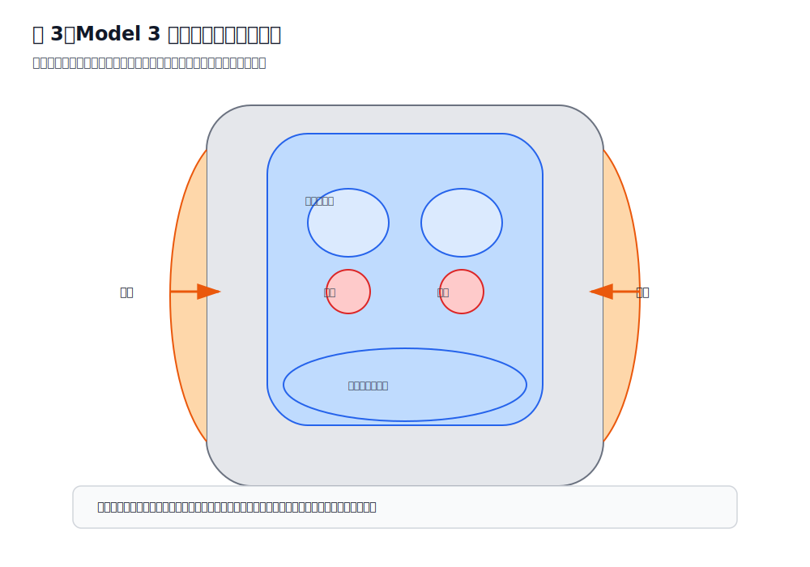

# 第四章 Tesla Model 3 座椅结构分析

> 本章核心观点：Tesla Model 3 的座椅不一定“错误”，但它的低坐姿、直接支撑、坐垫侧翼、前沿承托和电动车踏板几何，会放大部分驾驶者原本存在的骨盆后倾、大腿后侧紧张、右腿动态负荷和坐骨峰值压强问题。理解这些结构特征，比单纯追求某个固定座椅参数更重要。

---

## 4.1 为什么 Model 3 座椅值得单独分析

Tesla Model 3 的座椅具有几个明显特点：

1. **坐姿相对低**  
   驾驶者容易形成“髋部偏低、膝部相对偏高”的几何关系。

2. **坐垫支撑直接**  
   座椅不是传统豪华车那种厚软下陷式支撑，而是更直接地把压力反馈给臀部和大腿。

3. **坐垫侧翼存在包裹**  
   两侧包裹可以提升身体稳定性，但也可能让臀部两侧软组织产生挤压感。

4. **电动车油门控制更连续**  
   右脚对电门的细腻控制时间更长，右腿不是完全放松的承重结构，而是动态控制结构。

5. **靠背、腰托、高度、前沿之间耦合明显**  
   一个变量改变后，身体会通过骨盆、大腿、腰背和右脚重新找平衡。

因此，Model 3 座椅分析不能只问：

> “座椅高一点舒服，还是低一点舒服？”

更应该问：

> “这个调整把压力从哪里转移到了哪里？”  
> “它降低了坐骨峰值压强，还是制造了大腿后侧新压迫？”  
> “它让骨盆更中立，还是让身体更深地陷入侧翼？”  
> “右脚控制踏板是否更自然？”  

---

## 4.2 Model 3 座椅的受力系统

驾驶者与座椅之间不是一个简单接触面，而是一个受力系统：

```text
上半身重量
    ↓
靠背 / 腰托接收一部分
    ↓
骨盆
    ↓
坐骨 + 臀部软组织
    ↓
大腿后侧 / 坐垫前部
    ↓
右脚踏板控制形成动态负荷
```

其中，座椅主要影响五个区域：

| 区域 | 主要变量 | 常见体感 |
|---|---|---|
| 坐骨正下方 | 高度、骨盆、坐垫硬度 | 承重、压痛 |
| 坐骨后缘 / 尾骨方向 | 靠背、高度、骨盆后倾 | 后方疼、塌陷感 |
| 坐骨两侧软组织 | 坐垫侧翼、臀部张力 | 侧边肉被挤 |
| 大腿后侧 | 高度、前沿、前后位置 | 托住、紧硬、麻刺 |
| 右腿 / 脚踝 | 前后位置、踏板距离 | 累、紧、控制不自然 |



---

## 4.3 坐垫后部：坐骨与臀部的主承重区

坐垫后部是臀部和坐骨的主要承重区域。它决定：

- 坐骨是否能稳定落下；
- 臀部软组织是否能展开；
- 身体是否容易后瘫；
- 两侧侧翼是否夹住臀部；
- 骨盆是否容易后倾。

如果坐垫后部对驾驶者来说偏硬、偏窄或侧翼包裹明显，就可能出现：

```text
坐骨落下
  ↓
臀部软组织向两侧扩展
  ↓
侧翼限制软组织展开
  ↓
坐骨两侧肉被挤
```

这种感觉不是典型的“坐骨骨头疼”，而更像：

- 屁股侧边被夹；
- 坐骨两侧肉被挤住；
- 坐深后更明显；
- 换到办公椅也可能类似，但 Model 3 更容易放大。

### 工程判断

如果是坐垫后部 / 侧翼导致的挤压，通常有这些特征：

- 疼痛不是一个点，而是一片软组织压迫；
- 位置在坐骨两侧或臀部外下方；
- 坐得越深，包裹感越明显；
- 调整高度或前后只能部分改善；
- 放松臀部、改善骨盆后倾后可能减轻。

---

## 4.4 坐垫侧翼：稳定身体，也可能挤压软组织

Model 3 坐垫侧翼的作用是让驾驶者在转弯、加速、制动时更稳定。但侧翼对不同体型、不同骨盆姿态的人影响不同。

### 侧翼的积极作用

- 限制身体左右滑动；
- 提升高速或转弯时稳定性；
- 减少驾驶者用大腿主动夹紧身体；
- 让身体更容易保持在座椅中心。

### 侧翼的潜在问题

如果臀部软组织较多、骨盆略后倾、坐得较深，侧翼可能形成横向限制：

```text
俯视图：

左侧翼        坐垫中央        右侧翼
  ↑              ↓              ↑
  |            臀部              |
  |______软组织被横向限制_______|
```

此时驾驶者会感觉：

- 坐骨两侧肉被挤；
- 右侧更明显；
- 并非坐骨尖疼；
- 调整前沿后坐骨单点疼减少，但两侧挤压仍在。

这说明座椅已经降低了部分峰值压强，但软组织和侧翼之间的横向关系仍未完全解决。

---

## 4.5 坐垫前沿：大腿承托与神经压迫的平衡点

坐垫前沿是 Model 3 座椅调整中最敏感的区域之一。

前沿太低时：

- 大腿后侧参与承重不足；
- 坐骨承担更多重量；
- 坐骨峰值压强容易升高；
- 骨盆更容易后倒。

前沿适当升高时：

- 大腿与坐垫接触面积增加；
- 坐骨单点压力下降；
- 臀部 + 坐骨 + 大腿共同承重；
- 单点压痛可能改善。

前沿过高时：

- 大腿根压力明显；
- 大腿后侧紧硬；
- 腘窝方向压力增加；
- 可能出现麻、刺、过电感；
- 踩油门时大腿持续用力稳定。

简化对比：

```text
前沿偏低：
坐骨 ↑↑↑
大腿 ↓

前沿适中：
坐骨 ↑
臀部 ↑
大腿 ↑

前沿过高：
大腿后侧 ↑↑↑
腘窝风险 ↑
右腿操作负荷 ↑
```

因此，前沿高度的目标不是“尽量抬高”，而是找到：

> **大腿参与分担，但不被持续压迫的临界区间。**

---

## 4.6 座椅高度：决定髋膝关系和骨盆趋势

座椅高度改变的是髋关节相对于膝关节和踏板的空间关系。

### 高度偏低

如果座椅偏低，常见结果是：

- 髋部相对低；
- 膝部相对高；
- 大腿向上抬；
- 骨盆容易后倾；
- 腰椎容易变平；
- 坐骨后缘压力增加。

体感可能是：

- 坐得很低、像陷进去；
- 大腿根部空间小；
- 坐骨后方或尾骨方向不舒服；
- 右腿踩踏板时髋部不放松。

### 高度适中

适当升高可能带来：

- 髋部接近或略高于膝部；
- 骨盆更容易中立；
- 大腿后侧接触更连续；
- 坐骨峰值压强下降；
- 两侧软组织挤压可能减轻。

### 高度过高

过高会带来另一类问题：

- 大腿后侧持续受压；
- 腘窝附近风险增加；
- 脚跟支点变差；
- 踩踏板需要更多脚踝代偿；
- 大腿后侧紧硬、发麻。

### 对当前案例的意义

当前计划“先升高 1 cm，再观察”是合理的小步实验，因为它可能：

- 改善骨盆后倾；
- 减轻坐骨两侧软组织被挤；
- 保持坐骨单点疼下降的方向。

但必须观察大腿后侧是否因此更紧。如果升高后大腿后侧变成麻刺或持续硬胀，就说明高度已经越过当前身体状态的耐受区间。

---

## 4.7 前后位置：不是只决定腿够不够踏板

很多驾驶者把前后位置理解为：

> “能不能踩到刹车。”

这只是安全底线。实际上，前后位置还会改变：

- 髋关节角度；
- 膝关节角度；
- 大腿后侧张力；
- 脚跟支点；
- 右腿踩油门时是否持续绷紧；
- 身体是否需要前探。

### 座椅过近

可能表现为：

- 膝盖弯曲过多；
- 髋部空间不足；
- 大腿根部压力明显；
- 右腿不容易放松；
- 大腿后侧容易紧；
- 坐骨两侧软组织被挤压感加重。

### 座椅适当后移

后移 1 到 2 cm 可能带来：

- 腿部略伸展；
- 大腿根压力下降；
- 压力从臀下向大腿中段移动；
- 腘绳肌持续紧张下降；
- 踩油门更自然。

### 座椅过远

风险包括：

- 踩刹车到底时腿接近伸直；
- 脚尖够踏板；
- 身体为了够方向盘前探；
- 腰背离开靠背；
- 紧急制动安全性下降。

安全底线：

> 踩刹车到底时，膝盖必须保留明显弯曲；身体不能离开靠背去够踏板。

---

## 4.8 靠背角度：影响骨盆，也影响肩背是否能被接住

Model 3 的靠背角度对驾驶者体感影响很大。

### 靠背太躺

- 身体后滑；
- 骨盆后倾；
- 坐骨后缘压力增加；
- 腰椎变平；
- 右腿承担更多稳定工作。

### 靠背太直

- 腰背可能主动发力；
- 肩膀不一定放松；
- 若方向盘没有拉近，身体可能前探；
- 腰托容易变成硬顶。

### 合理状态

合理靠背应满足：

- 腰背能贴合；
- 肩膀能接触靠背；
- 手能自然扶方向盘；
- 不需要挺胸；
- 不向后瘫；
- 骨盆稳定；
- 右腿踩踏板时躯干不晃。

当前案例中，驾驶者描述“腰和靠背基本贴合、肩膀也贴合”，这说明靠背角度可能已经比早期更接近合理区间。后续不应优先大幅改靠背，而应优先验证高度和前后位置。

---

## 4.9 腰托：辅助支撑，而不是强行矫正

Model 3 原厂腰托如果充得过满，可能出现一种典型问题：

```text
骨盆仍然后倾
  ↓
腰托顶不进自然腰弧
  ↓
顶住整个腰背
  ↓
身体被推向前方
  ↓
大腿根和坐骨侧边压力增加
```

因此，腰托使用原则是：

1. 先坐深；
2. 找到骨盆接近中立；
3. 腰部出现自然小弧；
4. 再让腰托轻轻接住；
5. 不追求强烈顶腰感。

判断腰托过强的信号：

- 大腿根压力增加；
- 身体被往前推；
- 坐骨两侧更挤；
- 腰背被硬顶；
- 上身难以自然贴靠。

---

## 4.10 为什么右侧不适更常见

Model 3 驾驶时，右侧不适更常见，通常不是因为右侧座椅一定有问题，而是右腿承担了额外任务。

左腿多数时间相对放松，而右腿需要：

- 控制油门；
- 切换刹车；
- 维持脚跟支点；
- 脚踝小幅屈伸；
- 大腿和髋部稳定；
- 避免电门开度波动。

因此右侧结构承受的是：

```text
静态承重
  +
动态控制
  +
肌肉持续低强度收缩
```

这会解释一个典型现象：

> 完全离开油门后，右侧压力瞬间减轻。

这说明一部分不适不是纯粹来自座椅静态压迫，而是来自右腿参与踏板控制时的动态负荷。

---

## 4.11 Model 3 常见症状与可能结构原因

| 症状 | 可能结构因素 | 可能身体因素 | 优先验证 |
|---|---|---|---|
| 坐骨单点疼 | 高度低、前沿低、坐垫硬 | 骨盆后倾 | 轻微升高、前沿适度托住 |
| 坐骨两侧肉挤 | 坐垫侧翼、坐得太深 | 臀肌紧、骨盆旋转 | 高度微调、软组织放松 |
| 大腿根压力 | 前沿高、座椅太近 | 髋部紧 | 后移 1 cm、检查前沿 |
| 大腿后侧紧硬 | 高度/前沿偏高 | 腘绳肌紧 | 后移、拉伸、观察麻刺 |
| 右腿累 | 踏板距离、脚跟支点 | 髋膝踝控制紧张 | 前后位置、脚跟位置 |
| 腰被顶 | 腰托过强 | 平背、骨盆后倾 | 减小腰托、先摆骨盆 |

---

## 4.12 Model 3 座椅调节的变量优先级

对于当前案例，不建议无序调整。推荐优先级：

```text
第一优先级：高度
目的：改善髋膝关系与骨盆趋势

第二优先级：前后位置
目的：改善大腿根压力和右腿控制几何

第三优先级：前沿高度
目的：平衡坐骨压力和大腿承托

第四优先级：靠背角度
目的：让骨盆和肩背被接住

第五优先级：腰托
目的：轻微支撑自然腰弧

第六优先级：方向盘
目的：避免身体前探和肩膀离开靠背
```

当前案例的实际策略可以简化为：

```text
已完成：前沿抬高 → 坐骨单点痛减少

下一步：
升高 1 cm
↓
观察坐骨两侧软组织
↓
如大腿后侧仍紧
后移 1 cm
↓
观察大腿根和右腿控制
```

---

## 4.13 工程验证清单

每次调整后，至少观察三次驾驶，不建议一次驾驶就下最终结论。

### 调整后 5 分钟

- 是否马上出现大腿根顶压？
- 坐骨是否有尖点？
- 腰背是否自然贴合？
- 右脚是否能轻松控制油门？

### 调整后 30 分钟

- 坐骨单点疼是否出现？
- 坐骨两侧软组织挤压是否加重？
- 大腿后侧是承托感还是紧硬？
- 是否出现麻刺？

### 调整后 60 分钟

- 是否出现累积性酸胀？
- 右腿是否明显疲劳？
- 腰背是否还能贴合？
- 是否开始向前滑或向后瘫？

### 下车后

- 不适是否快速消失？
- 是否有残留麻木？
- 是否办公椅上也被放大？
- 第二天是否仍有紧硬？

---

## 4.14 本章小结

Tesla Model 3 座椅的关键不在于某个参数是否“标准”，而在于它如何影响压力分布。

- 坐垫后部决定坐骨和臀部主承重。
- 坐垫侧翼提供稳定，也可能挤压臀部软组织。
- 前沿高度可以降低坐骨单点压强，也可能增加大腿后侧压力。
- 座椅高度决定髋膝关系，影响骨盆后倾或中立。
- 前后位置不仅影响能否踩到踏板，也影响大腿根、大腿后侧和右腿控制。
- 靠背和腰托应帮助身体被接住，而不是强行顶出姿势。
- 右侧不适常与右腿动态控制负荷有关，不应只从静态座椅压迫解释。

下一章将进入座椅调节流程，把高度、前后、前沿、靠背、腰托和方向盘整合成可执行的工程化调整步骤。
