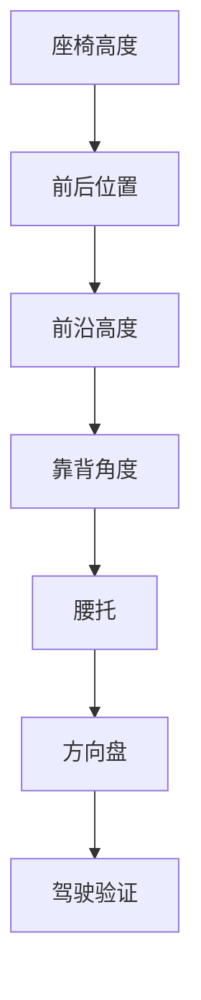

# 第五章 座椅调节流程

## 5.1 总原则：一次只调整一个变量

座椅调节最大的错误，是一次改太多：

- 高度改了；
- 前后也改了；
- 靠背也改了；
- 前沿也改了；
- 腰托也变了。

这样无法判断到底是哪一个变量产生了改善或副作用。

正确做法：

```text
一次只改一个变量
↓
连续驾驶 2 到 3 次
↓
记录 30 / 60 分钟反馈
↓
判断是否保留
```

## 5.2 推荐调节顺序

建议顺序：



原因：

1. 高度决定髋膝关系；
2. 前后决定踏板距离；
3. 前沿决定大腿承托；
4. 靠背决定骨盆和脊柱；
5. 腰托只能辅助，不能替代骨盆控制；
6. 方向盘决定上身是否需要前探。


## 5.3 当前案例中的微调方案

当前状态：

- 靠背较直；
- 腰和肩基本贴合靠背；
- 前沿已略微抬高；
- 坐骨单点疼痛减少；
- 大腿后侧紧硬；
- 坐骨两侧软组织仍有挤压；
- 办公椅也有类似感觉。

基于该状态，建议验证：

```text
第一步：座椅整体升高约 1 cm
↓
观察坐骨两侧软组织挤压是否下降
↓
第二步：若大腿根或大腿后侧仍紧，再后移约 1 cm
↓
观察大腿后侧紧硬是否缓解
```

## 5.4 为什么先升高 1 cm

轻微升高可能带来：

- 髋部位置略升；
- 骨盆更容易保持中立；
- 大腿参与承重更充分；
- 坐骨两侧软组织峰值压力下降。

但风险是：

- 大腿后侧压力可能增加；
- 若脚部控制变差，说明升高过多；
- 若出现麻刺，需要回退。

## 5.5 为什么再后移 1 cm

后移主要改变腿部几何关系：

- 腿相对伸展；
- 大腿根压力可能下降；
- 压力从臀下向大腿中段迁移；
- 腘绳肌持续紧张可能减轻。

但风险是：

- 踩刹车到底时膝盖不能过直；
- 身体不能为了够方向盘而前探；
- 右脚不能只用脚尖够踏板。

## 5.6 验证标准

每次调整后，至少记录：

| 指标 | 5分钟 | 30分钟 | 60分钟 |
|---|---:|---:|---:|
| 坐骨单点疼 | 0-10 | 0-10 | 0-10 |
| 坐骨两侧挤压 | 0-10 | 0-10 | 0-10 |
| 大腿后侧紧硬 | 0-10 | 0-10 | 0-10 |
| 大腿根压力 | 0-10 | 0-10 | 0-10 |
| 右腿踩油门疲劳 | 0-10 | 0-10 | 0-10 |
| 腰背支撑感 | 0-10 | 0-10 | 0-10 |

## 5.7 需要立即回退的信号

出现以下情况时，不建议继续坚持：

- 麻木；
- 针刺；
- 过电感；
- 疼痛沿大腿向小腿放射；
- 踩刹车时腿几乎伸直；
- 身体需要明显前探；
- 离车后症状持续不缓解。
