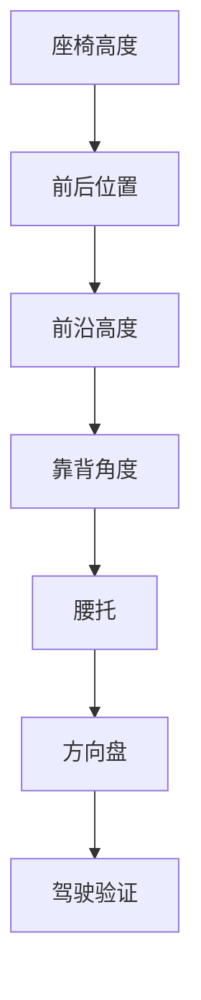
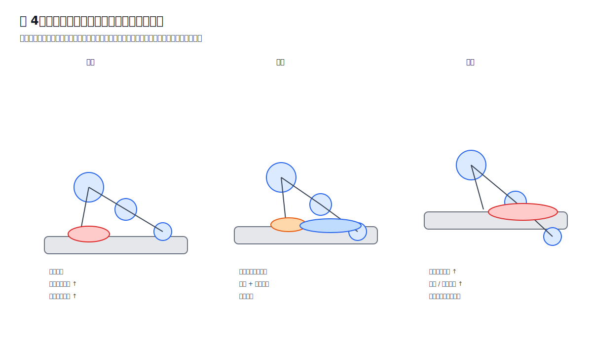

# 第五章 座椅调节流程

## 5.1 总原则：一次只调整一个变量

座椅调节最大的错误，是一次改太多：

- 高度改了；
- 前后也改了；
- 靠背也改了；
- 前沿也改了；
- 腰托也变了。

这样无法判断到底是哪一个变量产生了改善或副作用。

正确做法：

```text
一次只改一个变量
↓
连续驾驶 2 到 3 次
↓
记录 30 / 60 分钟反馈
↓
判断是否保留
```

## 5.2 推荐调节顺序

建议顺序：



原因：

1. 高度决定髋膝关系；
2. 前后决定踏板距离；
3. 前沿决定大腿承托；
4. 靠背决定骨盆和脊柱；
5. 腰托只能辅助，不能替代骨盆控制；
6. 方向盘决定上身是否需要前探。



## 5.3 调节前的初始设定

在开始任何微调之前，先建立一个安全且可重复的初始姿势。否则后续每一次变化都会混入新的干扰。

初始设定建议按下面顺序完成：

1. 臀部坐到座椅后部，但不要刻意把自己塞进靠背。
2. 双脚自然放在踏板区，右脚脚跟能稳定落地。
3. 踩刹车到底时，膝盖仍保留明显弯曲。
4. 背部贴住靠背，肩膀不需要离开靠背去够方向盘。
5. 腰托先调到很轻或中低位置，不要一开始就打满。
6. 方向盘拉到手臂自然弯曲的位置，避免身体前探。

这个初始姿势不是最终答案，只是为了让后续变量可控。

## 5.4 安全底线

任何舒适性调整都不能突破驾驶安全底线。

必须满足：

- 刹车到底时膝盖不能接近伸直；
- 右脚不能只靠脚尖够踏板；
- 身体不能离开靠背才能握住方向盘；
- 视野不能因为座椅过低或过高而受影响；
- 安全带不能勒到颈部或被身体姿势改变；
- 调整后不应影响后视镜、外后视镜和盲区观察。

如果一个设置让身体更舒服，但让刹车、转向或视野变差，它就不是可保留设置。

## 5.5 当前案例中的微调方案

当前状态：

- 靠背较直；
- 腰和肩基本贴合靠背；
- 前沿已略微抬高；
- 坐骨单点疼痛减少；
- 大腿后侧紧硬；
- 坐骨两侧软组织仍有挤压；
- 办公椅也有类似感觉。

基于该状态，建议验证：

```text
第一步：座椅整体升高约 1 cm
↓
观察坐骨两侧软组织挤压是否下降
↓
第二步：若大腿根或大腿后侧仍紧，再后移约 1 cm
↓
观察大腿后侧紧硬是否缓解
```

## 5.6 为什么先升高 1 cm

轻微升高可能带来：

- 髋部位置略升；
- 骨盆更容易保持中立；
- 大腿参与承重更充分；
- 坐骨两侧软组织峰值压力下降。

但风险是：

- 大腿后侧压力可能增加；
- 若脚部控制变差，说明升高过多；
- 若出现麻刺，需要回退。

## 5.7 为什么再后移 1 cm

后移主要改变腿部几何关系：

- 腿相对伸展；
- 大腿根压力可能下降；
- 压力从臀下向大腿中段迁移；
- 腘绳肌持续紧张可能减轻。

但风险是：

- 踩刹车到底时膝盖不能过直；
- 身体不能为了够方向盘而前探；
- 右脚不能只用脚尖够踏板。

## 5.8 六个变量的调节矩阵

下表用于在出现症状时快速选择优先变量。它不是绝对规则，而是减少乱调的工程顺序。

| 主要目标 | 优先变量 | 小步幅度 | 观察重点 | 常见副作用 |
|---|---|---:|---|---|
| 减少坐骨后缘疼 | 高度 / 靠背 | 高度 1 cm，靠背 1 小格 | 骨盆是否更稳 | 大腿压力增加 |
| 减少坐骨单点疼 | 前沿 / 高度 | 1 小格 | 接触面积是否增加 | 大腿后侧紧硬 |
| 减少两侧软组织挤压 | 高度 / 前后 | 1 cm | 侧翼挤压是否下降 | 脚跟支点变化 |
| 减少大腿根压力 | 前后 / 前沿 | 后移 1 cm | 髋部空间是否变大 | 踏板距离变远 |
| 减少右腿疲劳 | 前后 / 脚跟 | 1 cm 或脚跟重置 | 油门控制是否自然 | 刹车安全风险 |
| 改善腰背贴合 | 靠背 / 腰托 | 1 小格 | 是否被接住而非硬顶 | 大腿根被推 |

优先级判断：

```text
先处理安全与麻刺
↓
再处理坐骨尖点
↓
再处理大腿压力
↓
最后微调腰托和方向盘
```

## 5.9 调整后的三次驾驶复盘法

一次驾驶不能说明问题。建议至少用三次驾驶判断：

### 第一次：发现副作用

重点看：

- 是否马上出现麻刺；
- 刹车是否安全；
- 右脚是否需要够踏板；
- 坐骨疼是否明显复发。

如果出现风险信号，当天就回退。

### 第二次：确认重复性

重点看：

- 同一时间点是否重复出现同一症状；
- 不适是否比第一次轻；
- 是否受当天办公久坐影响；
- 下车后恢复速度是否稳定。

如果第一次不适、第二次明显改善，可以继续观察。

### 第三次：决定保留或回退

重点看：

- 目标症状是否比基线下降至少 2 分；
- 新症状是否低于 3 到 4 分；
- 是否没有麻刺、放射、无力；
- 是否不影响驾驶安全。

满足多数条件才保留。

## 5.10 验证标准

每次调整后，至少记录：

| 指标 | 5分钟 | 30分钟 | 60分钟 |
|---|---:|---:|---:|
| 坐骨单点疼 | 0-10 | 0-10 | 0-10 |
| 坐骨两侧挤压 | 0-10 | 0-10 | 0-10 |
| 大腿后侧紧硬 | 0-10 | 0-10 | 0-10 |
| 大腿根压力 | 0-10 | 0-10 | 0-10 |
| 右腿踩油门疲劳 | 0-10 | 0-10 | 0-10 |
| 腰背支撑感 | 0-10 | 0-10 | 0-10 |

## 5.11 常见错误

### 错误一：坐骨一疼就把座椅降到最低

降低座椅可能短时间减少大腿压力，但也可能让髋部低于膝部，增加骨盆后倾和坐骨后缘压力。

### 错误二：前沿越高越好

前沿抬高可以增加大腿承托，但过高会把压力转移到大腿后侧或腘窝附近。

### 错误三：腰托当成姿势矫正器

腰托只能接住已经接近合理的腰弧。骨盆仍然后倾时，强腰托容易把身体推向前方。

### 错误四：为了右腿舒服而把座椅后移太多

后移可以打开髋膝角度，但过远会破坏刹车安全，让身体前探。

### 错误五：每天都调

每天都调会让记录失去意义。除非出现麻刺或安全问题，否则建议一个变量至少观察 2 到 3 次驾驶。

## 5.12 需要立即回退的信号

出现以下情况时，不建议继续坚持：

- 麻木；
- 针刺；
- 过电感；
- 疼痛沿大腿向小腿放射；
- 踩刹车时腿几乎伸直；
- 身体需要明显前探；
- 离车后症状持续不缓解。

## 5.13 本章小结

座椅调节的关键不是找到一个神秘参数，而是建立稳定流程：

```text
初始安全姿势
↓
一次只改一个变量
↓
小步调整
↓
三次驾驶验证
↓
按数据保留或回退
```

对当前案例而言，最合理的下一步仍然是小步验证，而不是推翻全部设置。先保留已经降低坐骨单点疼的方向，再用高度和前后位置去处理两侧软组织挤压、大腿后侧紧硬和右腿动态负荷。
