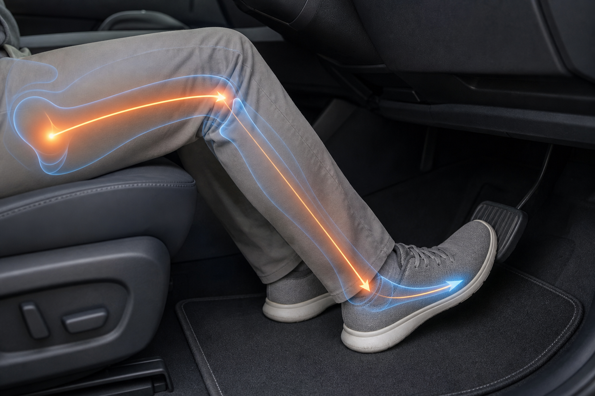

# 第六章 踏板几何与右腿疲劳

> 本章核心观点：驾驶坐姿与办公坐姿最大的区别，是右腿不是完全放松的承重结构，而是持续参与油门、刹车和身体稳定的动态控制结构。右侧大腿后侧紧硬、臀下压迫、坐骨侧边挤压，常常不能只用“座椅压迫”解释，还必须把踏板几何和右腿肌肉工作纳入分析。

---

## 6.1 驾驶坐姿不是普通坐姿

办公坐姿中，双腿多数时间可以相对放松。即使坐姿不理想，腿部仍有机会通过改变脚的位置、站起、换姿势来缓解。

驾驶坐姿不同。它受到三个约束：

1. **臀部和大腿要坐稳**；
2. **右脚必须持续控制油门和刹车**；
3. **身体不能随意移动，因为要保证驾驶安全**。

因此，驾驶中的右腿同时承担两类任务：

```text
静态任务：大腿 / 臀部承重
动态任务：脚踝 / 小腿 / 大腿 / 髋部控制踏板
```

这就是为什么右腿更容易比左腿疲劳。

---

## 6.2 右腿控制油门时，哪些结构在工作

右脚踩油门不是只有脚在动。实际上，至少有以下结构参与：

- 脚跟：作为支点；
- 脚踝：控制油门开度；
- 小腿前后肌群：维持脚部角度；
- 股四头肌：帮助稳定膝关节；
- 腘绳肌：帮助控制大腿和膝关节；
- 臀肌：稳定髋部和骨盆；
- 腰背：维持躯干与骨盆关系。

简化链条：

```text
油门踏板
  ↑
前脚掌
  ↑
脚踝控制
  ↑
小腿稳定
  ↑
膝关节角度
  ↑
大腿后侧 / 股四头肌
  ↑
髋部与骨盆稳定
```

因此，右腿不适有时并不是座椅某个点压住了，而是右腿一直处在轻微用力状态。


真实驾驶中，这条负荷链并不会像图表一样有清晰边界。它更像下图所示：脚跟、脚踝、小腿、膝关节、大腿后侧和髋部在低强度地一起工作。



---

## 6.3 为什么离开油门后压力会瞬间减轻

一个非常重要的现象是：

> 完全离开油门后，右侧压力瞬间减轻。

这个现象说明不适中至少有一部分来自动态肌肉负荷，而不仅仅是静态压迫。

可能机制：

```text
踩油门时：
右脚需要控制踏板
↓
脚踝、小腿、大腿持续低强度收缩
↓
髋部和骨盆右侧参与稳定
↓
右侧臀下和大腿后侧张力升高
↓
坐骨侧边 / 大腿后侧压力更明显

离开油门后：
动态控制负荷消失
↓
右腿肌肉张力下降
↓
软组织压力下降
↓
体感瞬间减轻
```

这类不适如果只通过调整坐垫，往往改善有限。必须同时检查：

- 座椅前后；
- 脚跟位置；
- 脚踝角度；
- 大腿是否持续悬空或被顶住；
- 右脚是否需要用力“够”踏板。

---

## 6.4 脚跟支点：右腿疲劳的关键

驾驶时，脚跟通常应稳定落在地板上。脚跟是右脚控制油门的支点。

### 脚跟太靠后

可能导致：

- 脚踝过度伸展；
- 前脚掌够油门；
- 小腿持续紧；
- 大腿后侧参与稳定；
- 踩油门不细腻。

### 脚跟太靠前

可能导致：

- 脚踝角度过小；
- 右膝弯曲过多；
- 大腿根部压迫；
- 髋部空间不足；
- 大腿后侧紧硬。

### 合理状态

合理脚跟支点应满足：

- 脚跟能稳定落地；
- 脚踝小幅度控制油门；
- 不需要抬整条腿；
- 不需要用脚尖够油门；
- 刹车切换时不需要身体前探；
- 大腿不持续绷紧。

---

## 6.5 座椅前后位置对右腿的影响

前后位置是右腿疲劳最重要的座椅变量之一。

### 座椅过近

表现：

- 膝盖弯曲过多；
- 大腿根空间不足；
- 大腿后侧容易压在坐垫上；
- 髋部和臀部被挤；
- 右腿踩油门时不放松。

受力变化：

```text
座椅过近：
髋角小
膝角小
大腿根压力 ↑
右腿控制空间 ↓
```

### 座椅适当后移

可能改善：

- 髋膝角度打开；
- 大腿根压力下降；
- 大腿后侧紧张下降；
- 油门控制更自然；
- 坐骨两侧软组织被挤可能减轻。

### 座椅过远

风险：

- 右脚用脚尖够踏板；
- 脚踝持续紧张；
- 刹车到底时膝盖过直；
- 身体前探；
- 腰背离开靠背。

因此，后移 1 cm 是合理的微调；一次后移太多则会破坏安全和支撑。

---

## 6.6 座椅高度对右腿的影响

高度改变的是髋、膝、踝三者之间的关系。

### 高度偏低

- 髋部低；
- 膝部相对高；
- 骨盆更容易后倾；
- 大腿根空间变小；
- 踩踏板时右髋不放松。

### 高度适中

- 髋部接近或略高于膝部；
- 脚跟稳定；
- 大腿有承托；
- 右腿控制更自然。

### 高度过高

- 大腿后侧压力增加；
- 脚跟可能不稳定；
- 踝关节控制负担增加；
- 大腿后侧可能紧硬或麻刺。

当前案例计划先升高 1 cm 是为了改善骨盆和坐骨两侧软组织压力，但需要同步观察右腿：

- 油门是否更轻松；
- 刹车是否安全；
- 大腿后侧是否更紧；
- 脚跟是否还能稳定落地。

---

## 6.7 前沿高度对右腿的影响

前沿高度直接影响大腿后侧承托。

### 前沿偏低

- 大腿承托不足；
- 坐骨承担更多压力；
- 右腿可能需要主动稳定大腿；
- 坐骨单点疼风险增加。

### 前沿适中

- 大腿后侧参与分担；
- 坐骨峰值压强下降；
- 腿部不需要过度悬空；
- 油门控制更稳定。

### 前沿过高

- 大腿后侧持续受压；
- 膝窝风险增加；
- 右腿控制踏板时更紧；
- 可能出现紧硬、麻刺、过电感。

因此，前沿高度的判断标准不是“托得多不多”，而是：

> 大腿是否被均匀托住，同时右脚还能轻松控制踏板。

---

## 6.8 右侧坐骨和大腿为什么可能比左侧更明显

左腿多数时间可以相对放松，而右腿需要持续控制油门。于是左右两侧受力模式不同：

```text
左侧：
静态承重为主

右侧：
静态承重
+
油门控制
+
脚踝稳定
+
大腿肌肉低强度持续收缩
+
骨盆右侧微稳定
```

因此，右侧更容易出现：

- 大腿后侧硬；
- 坐骨外侧挤；
- 臀下压力明显；
- 踩油门时加重；
- 松开油门时缓解。

如果右侧不适明显，但左右座椅结构相同，就应优先考虑动态控制因素，而不是假设座椅右侧有结构缺陷。

---

## 6.9 右腿疲劳的五种类型

| 类型 | 典型感觉 | 可能机制 | 优先检查 |
|---|---|---|---|
| 大腿根压迫 | 臀下横向压 | 座椅过近、前沿高 | 后移 1 cm |
| 大腿后侧紧硬 | 整片紧、硬 | 承托强、腘绳肌紧 | 前沿、高度、拉伸 |
| 小腿酸 | 小腿持续紧 | 脚踝角度不佳 | 脚跟支点、前后 |
| 脚踝累 | 控油不自然 | 踏板距离不佳 | 座椅前后、高度 |
| 坐骨右侧挤 | 右臀下压力 | 右腿动态稳定 | 脚跟、油门姿势 |

---

## 6.10 当前案例的右腿解释

当前案例中有几个关键信号：

1. 坐骨单点疼下降；
2. 大腿后侧压力明显；
3. 坐骨两侧软组织仍挤；
4. 办公椅也类似；
5. 完全离开油门后压力可明显减轻。

综合判断：

```text
静态座椅压力
+
大腿后侧承托增加
+
腘绳肌 / 臀肌张力
+
右腿油门控制负荷
```

共同造成当前体感。

因此，只靠继续抬高或降低座椅，可能会在不同区域之间“搬运压力”。更合理的路径是：

```text
座椅升高 1 cm
↓
看坐骨两侧是否减轻
↓
如果大腿后侧仍紧
座椅后移 1 cm
↓
看右腿控制是否更自然
↓
同步记录脚跟位置和油门控制感
```

---

## 6.11 右腿控制自检

车辆静止时进行，不要在行驶中测试。

### 自检 1：脚跟稳定性

右脚放在油门位置，观察：

- 脚跟是否稳定落地；
- 是否需要抬起整条腿；
- 是否只用脚尖够油门；
- 脚踝能否小幅度控制。

### 自检 2：刹车到底安全性

踩刹车到底，观察：

- 膝盖是否仍有弯曲；
- 身体是否离开靠背；
- 髋部是否被拉扯；
- 脚是否需要伸到极限。

### 自检 3：松开油门对比

短暂停车时对比：

```text
右脚保持油门姿势 30 秒
↓
感受右臀和大腿后侧压力

右脚完全放松离开油门 30 秒
↓
感受压力是否迅速下降
```

如果下降明显，说明动态控制负荷占比很高。

---

## 6.12 本章小结

驾驶中的右腿不是被动放在座椅上的结构，而是持续参与控制的动态系统。

- 右腿同时承重和操作踏板。
- 右侧不适常常比左侧明显。
- 离开油门后压力瞬间减轻，说明动态肌肉负荷很重要。
- 座椅前后位置对大腿根和右腿疲劳影响很大。
- 座椅高度和前沿高度需要同时考虑脚跟支点和脚踝控制。
- 后移 1 cm 是一个合理的小步验证，但不能牺牲刹车安全和靠背贴合。

后续所有座椅调节，都应该同时记录静态压力和右腿动态控制感。只有这样，才能区分“座椅压迫”和“右腿工作导致的紧张”。
