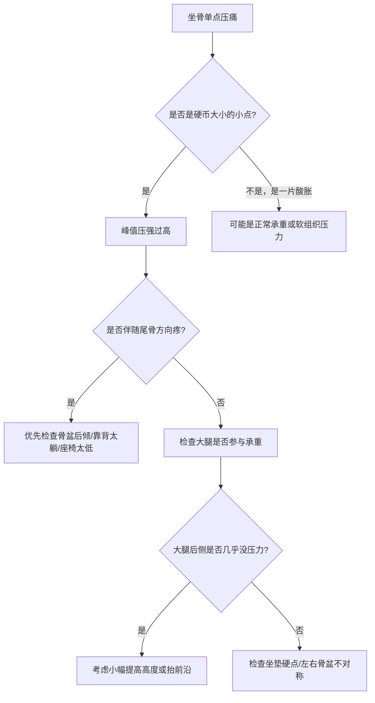
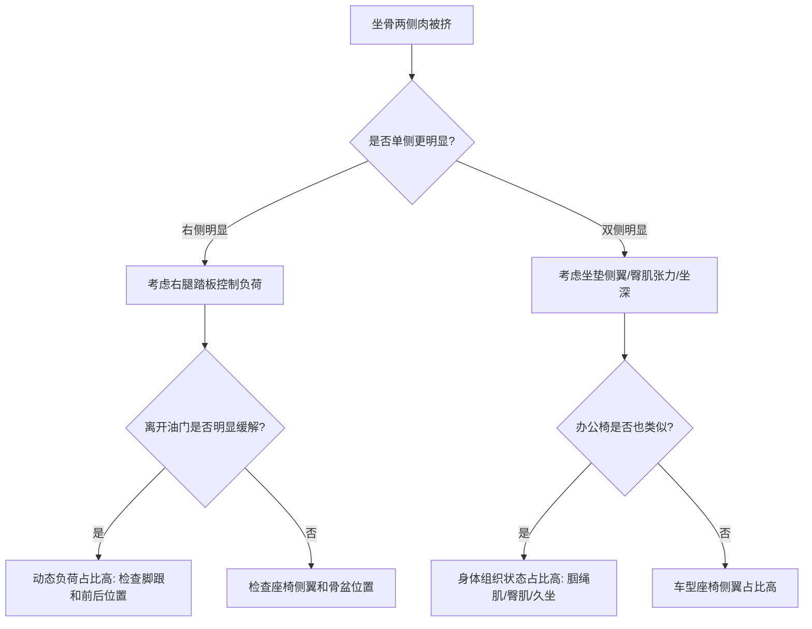
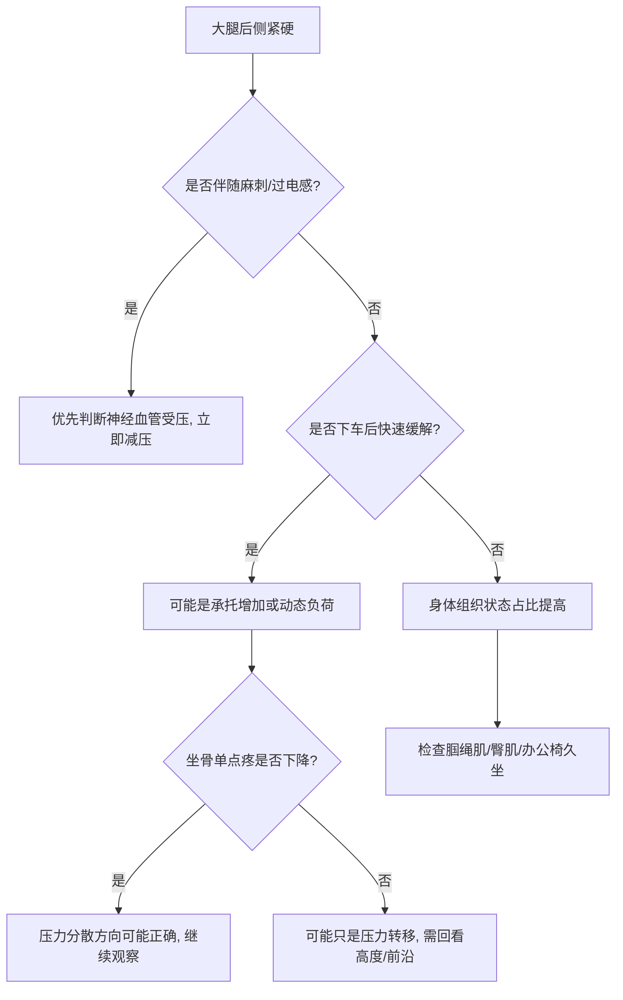
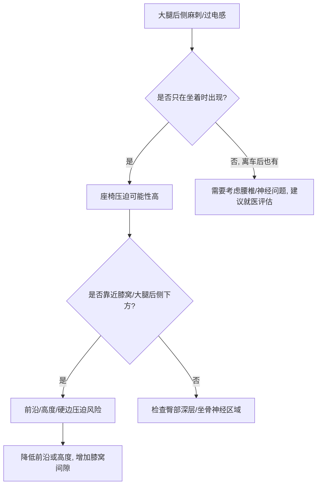
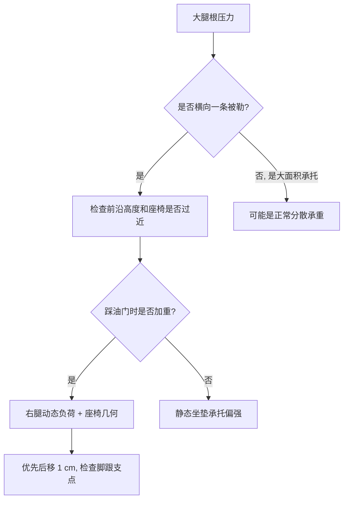
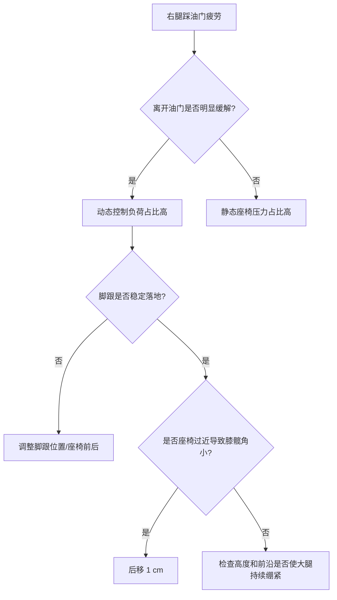
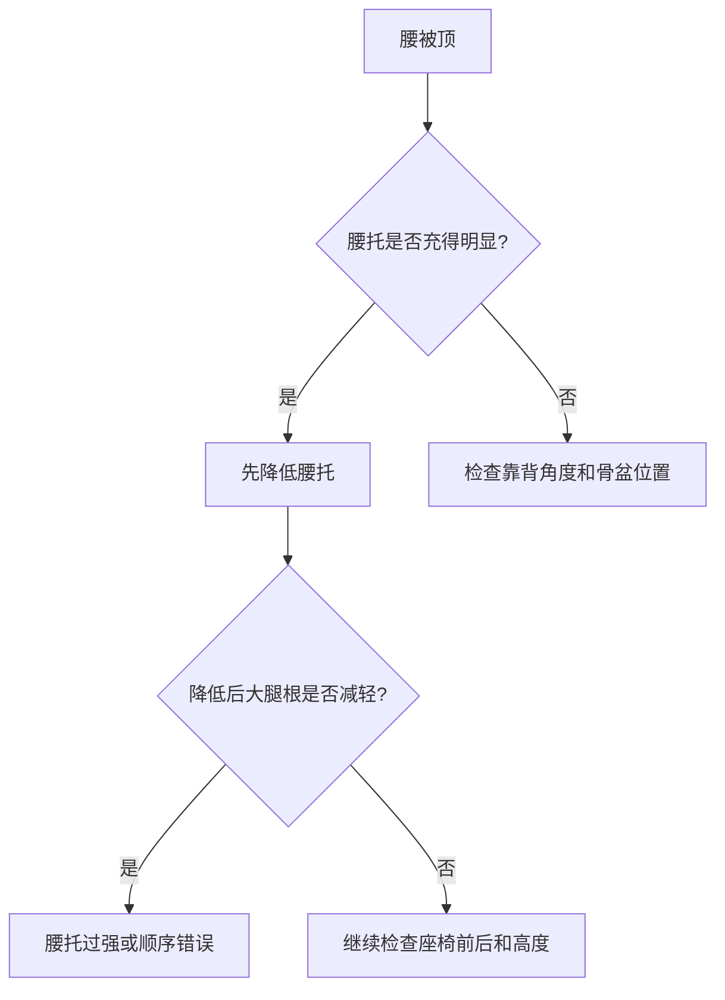
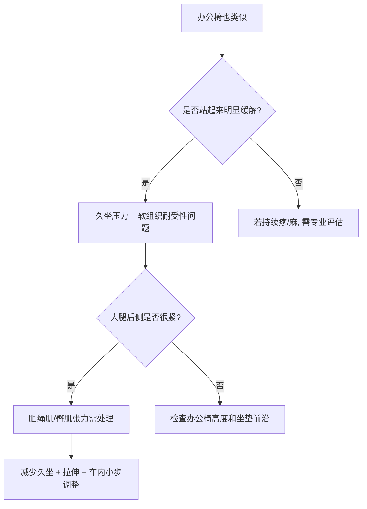
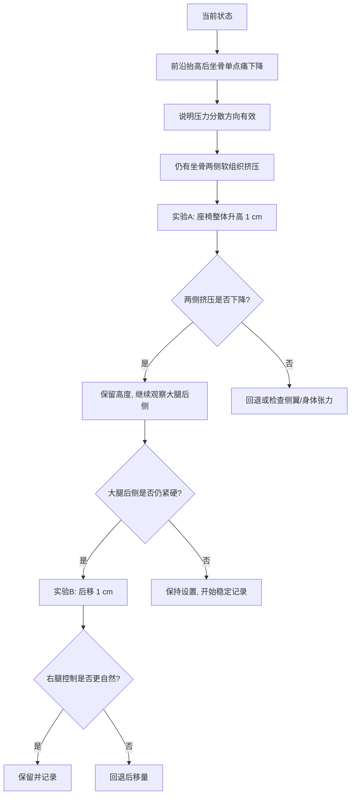

# 第七章 症状决策树

> 本章核心观点：座椅调节不能只根据“哪里疼”直接下结论。相同位置的不适，可能来自不同机制；相同机制，也可能表现为不同位置的不适。决策树的作用，是把模糊体感转化为可验证的工程判断。

---

## 7.1 使用决策树之前的原则

在进入具体症状前，先遵守三个原则。

### 原则一：先分类，再调整

不要一出现不适就立即调座椅。先判断它属于哪一类：

```text
压力集中
肌肉紧张
神经压迫
踏板控制负荷
靠背 / 腰托支撑问题
久坐耐受性问题
```

分类错误，调整方向就会错。

### 原则二：一次只调整一个变量

每次只改一个变量：

- 高度；
- 前后；
- 前沿；
- 靠背；
- 腰托；
- 方向盘；
- 脚跟位置。

不要一次同时改高度、前后、前沿和靠背。否则无法判断哪个变量有效，哪个变量带来副作用。

### 原则三：用时间验证，不用上车瞬间判断

建议至少记录：

- 5 分钟：初始感觉；
- 30 分钟：软组织压力开始显现；
- 60 分钟：真实耐受性；
- 下车后：是否有残留；
- 第二天：是否有延迟反应。

---

## 7.2 决策树总览

可以先从这个总表判断方向。

| 主要症状 | 优先怀疑 | 优先检查 | 第一调整方向 |
|---|---|---|---|
| 坐骨一个点疼 | 峰值压强高 | 骨盆、前沿、高度 | 增加接触面积 |
| 坐骨后方 / 尾骨方向疼 | 骨盆后倾 | 靠背、高度、腰托 | 骨盆回中立 |
| 坐骨两侧肉被挤 | 侧翼 + 软组织张力 | 高度、坐深、臀肌 | 小幅升高或后移 |
| 大腿后侧紧硬 | 大腿承托强 / 腘绳肌紧 | 高度、前沿、前后 | 后移或降低前沿 |
| 大腿后侧麻刺 | 神经血管受压 | 前沿、高度、硬边 | 立即减压 |
| 大腿根压力 | 座椅太近 / 前沿高 | 前后、前沿 | 后移 1 cm |
| 右腿踩油门累 | 踏板几何不佳 | 脚跟、前后、高度 | 调脚跟和前后 |
| 腰被顶 | 腰托过强 / 顺序错误 | 腰托、骨盆 | 降低腰托 |
| 办公椅也类似 | 身体组织状态 | 腘绳肌、臀肌、久坐 | 减少久坐 + 拉伸 |


---

## 7.3 决策树一：坐骨单点压痛

### 典型描述

- 坐骨附近一个点疼；
- 像硬币大小；
- 越坐越明显；
- 起身后缓解；
- 大腿参与承重少；
- 调整后痛点会移动。

### 可能机制

```text
坐骨单点疼
   ↓
局部接触面积太小
   ↓
峰值压强升高
   ↓
软组织缺血 / 神经敏感
   ↓
疼痛累积
```

### 判断流程



### 优先调整

1. 先确认骨盆不是明显后倾；
2. 适当增加大腿后侧承托；
3. 小幅调整高度或前沿；
4. 避免一次调整过大；
5. 记录 30 / 60 分钟变化。

### 保留信号

- 坐骨单点疼下降；
- 大腿压力变成大面积承托；
- 不出现麻刺；
- 下车后无残留。

### 回退信号

- 坐骨单点疼转移成大腿后侧麻刺；
- 大腿根明显横向压迫；
- 踩踏板变累；
- 坐骨后方 / 尾骨方向疼加重。

---

## 7.4 决策树二：坐骨两侧软组织挤压

### 典型描述

- 不是骨头尖疼；
- 是坐骨两侧肉被挤；
- 臀部侧边有夹住感；
- 坐深后更明显；
- Model 3 更明显，办公椅也可能出现。

### 可能机制

```text
坐骨两侧软组织挤压
   ↓
座椅侧翼限制
   +
臀部软组织张力
   +
骨盆姿态
   +
右腿动态负荷
```

### 判断流程



### 优先调整

当前案例中可按以下顺序：

```text
第一步：小幅升高 1 cm
目的：改善骨盆和坐骨两侧软组织压力

第二步：若大腿后侧仍紧，后移 1 cm
目的：减轻大腿根和右腿动态负荷
```

### 保留信号

- 两侧挤压下降；
- 坐骨单点疼不复发；
- 大腿后侧没有麻刺；
- 腰和肩仍能贴合靠背；
- 踩油门更自然或不变差。

### 回退信号

- 大腿后侧麻刺；
- 大腿根被横向勒住；
- 坐骨单点疼复发；
- 右腿踩踏板更累；
- 腰背离开靠背。

---

## 7.5 决策树三：大腿后侧紧硬

### 典型描述

- 大腿后侧一大片紧；
- 肌肉像硬的；
- 坐久更明显；
- 可能开车和办公椅都有；
- 不一定是单点疼。

### 先区分两类

```text
A 类：大面积承托感
- 有压力
- 不麻
- 不刺
- 下车后很快缓解
- 坐骨单点疼减少

B 类：异常紧硬
- 越坐越硬
- 伴随麻刺
- 下车后仍残留
- 办公椅也明显
```

### 判断流程



### 优先调整

如果没有麻刺：

1. 先检查是否前沿过高；
2. 若座椅较近，尝试后移 1 cm；
3. 若高度刚升高，观察是否加重大腿压力；
4. 同步做腘绳肌和臀肌放松；
5. 不要立刻大幅降低，避免坐骨单点疼复发。

如果有麻刺：

1. 立即降低前沿或整体高度；
2. 检查是否有硬边压迫；
3. 避免继续硬扛；
4. 若离车后仍持续，应咨询专业人士。

---

## 7.6 决策树四：大腿后侧麻刺 / 过电感

### 典型描述

- 麻；
- 刺；
- 过电；
- 不是普通酸胀；
- 沿大腿后方走；
- 有时伴随小腿方向牵扯。

### 判断流程



### 优先原则

麻刺不是普通压力感。它比“有压力”“有酸胀”更需要谨慎。

### 回退信号

只要出现以下情况，优先回退最近一次调整：

- 麻刺加重；
- 坐一会儿后向小腿放射；
- 下车后持续；
- 伴随无力；
- 夜间也有异常感。

---

## 7.7 决策树五：大腿根压力

### 典型描述

- 臀部下面一条横向压力；
- 大腿根像被顶住；
- 前沿抬高后更明显；
- 座椅靠前时更明显；
- 后移后可能缓解。

### 判断流程



### 优先调整

1. 若座椅偏近，先后移 1 cm；
2. 若前沿明显高，再略降前沿；
3. 若刚升高座椅后出现，观察高度是否过高；
4. 确认刹车到底安全。

### 保留信号

- 大腿根压力下降；
- 踩踏板自然；
- 坐骨单点疼不复发；
- 大腿后侧不麻。

---

## 7.8 决策树六：右腿踩油门疲劳

### 典型描述

- 右腿比左腿累；
- 大腿后侧或臀下右侧紧；
- 脚踝控制不自然；
- 离开油门压力下降；
- 长时间电门控制后加重。

### 判断流程



### 优先调整

1. 先找稳定脚跟支点；
2. 检查是否座椅过近；
3. 后移 1 cm 是优先小步实验；
4. 不要为了解决右腿累而把座椅调到刹车不安全；
5. 检查方向盘是否导致身体前探。

---

## 7.9 决策树七：腰被顶 / 腰托不适

### 典型描述

- 腰托一充气，大腿就被往前推；
- 腰不是被支撑，而是被顶；
- 身体前滑；
- 大腿根压力增加；
- 坐骨两侧更挤。

### 判断流程



### 正确顺序

```text
先坐深
↓
找骨盆中立
↓
腰部自然出现小弧
↓
腰托轻轻接住
```

错误顺序：

```text
骨盆仍然后倾
↓
腰托打满
↓
腰托顶不进腰窝
↓
整个人被推向前
```

---

## 7.10 决策树八：办公椅也有类似感觉

### 典型描述

- 开车有大腿后侧紧；
- 办公椅也有；
- 坐骨两侧软组织也类似；
- 站起来明显缓解；
- 不是某一张椅子独有。

### 判断流程



### 处理策略

如果办公椅也类似，不要把所有问题都归因于 Model 3。

需要同步做：

- 每 30 到 45 分钟起身；
- 腘绳肌拉伸；
- 臀肌 / 梨状肌放松；
- 髋屈肌活动；
- 骨盆前后摇摆练习；
- 办公椅高度与坐深调整；
- 驾驶座椅小步验证。

---

## 7.11 调整后如何判断保留还是回退

每次调整后不要只问“舒服了吗”。应按下面标准判断。

### 可以保留的信号

满足越多，越说明方向正确：

- 坐骨单点疼下降；
- 坐骨两侧软组织挤压下降；
- 大腿后侧只是有承托，不麻不刺；
- 大腿根压力下降；
- 右腿踩油门更自然；
- 腰背和肩膀仍能贴合靠背；
- 刹车到底时膝盖仍有弯曲；
- 下车后不适快速消失；
- 第二天没有残留恶化。

### 需要继续观察的信号

- 有新压力，但不疼不麻；
- 大腿压力变明显，但坐骨单点疼下降；
- 坐骨存在感增强，但不是尖锐疼；
- 30 分钟内可以接受，60 分钟后才明显。

这类情况不建议马上回退，可记录 2 到 3 次。

### 需要回退的信号

出现以下任一情况，应优先回退最近一次调整：

- 麻、刺、过电感；
- 疼痛向小腿放射；
- 刹车到底时腿接近伸直；
- 身体需要前探；
- 腰背离开靠背；
- 下车后仍持续不适；
- 坐骨单点疼明显复发；
- 右腿踩踏板明显更累。

---

## 7.12 当前案例的决策路径

根据当前状态：

- 坐骨单点疼下降；
- 大腿后侧压力明显；
- 坐骨两侧软组织仍挤；
- 腰和肩能贴合靠背；
- 办公椅也类似；
- 右侧与油门控制有关。

推荐路径是：



### 当前最重要的验证点

1. 升高 1 cm 后，坐骨两侧软组织是否下降；
2. 升高后，大腿后侧是否变成麻刺；
3. 后移 1 cm 后，大腿根和右腿控制是否改善；
4. 刹车到底是否仍安全；
5. 办公椅同类症状是否随拉伸和减少久坐改善。

---

## 7.13 本章小结

症状决策树的目的不是给出一次性答案，而是建立可迭代的判断系统。

- 坐骨单点疼：优先考虑峰值压强；
- 坐骨两侧肉挤：考虑侧翼、软组织张力、骨盆和右腿动态负荷；
- 大腿后侧紧硬：先区分承托感和异常紧张；
- 大腿后侧麻刺：优先减压，不要硬扛；
- 大腿根压力：优先检查座椅过近和前沿高度；
- 右腿疲劳：必须把踏板几何纳入分析；
- 腰被顶：先调整腰托顺序和强度；
- 办公椅也类似：说明身体组织状态也参与了问题。

真正有效的座椅调节，不是找到一个永远不变的位置，而是形成一套稳定的判断方法：

```text
症状分类
↓
机制判断
↓
小步调整
↓
时间验证
↓
保留或回退
```
