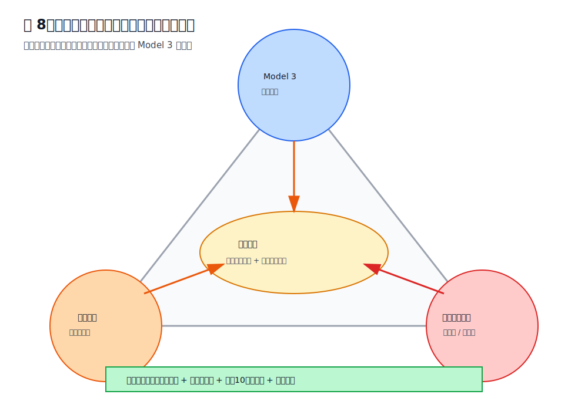
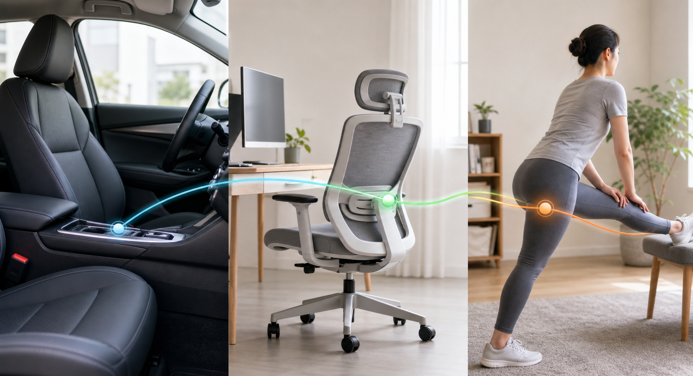

# 第八章 康复与办公椅联动

> 本章核心观点：如果驾驶座和办公椅都会引发大腿后侧紧硬、坐骨两侧软组织挤压或臀下压力，那么问题就不能只用“Model 3 座椅不合适”解释。此时必须把身体组织状态、久坐耐受性和办公椅姿势纳入同一个系统。

---

## 8.1 为什么“办公椅也有类似感觉”是关键信号

如果不适只在 Tesla Model 3 上出现，而办公椅、沙发、餐椅都没问题，那么车辆座椅几何可能是主因。

但如果出现下面情况：

- 开车时大腿后侧紧硬；
- 办公椅久坐时也有类似紧硬；
- 坐骨两侧软组织在不同椅子上都有挤压感；
- 站起来或走几分钟后明显缓解；
- 上午轻，下午久坐后加重；

那么就说明问题很可能是：

```text
座椅压力
  +
身体软组织张力
  +
骨盆控制习惯
  +
久坐耐受性下降
```

这时继续只在车里调高、调低、前移、后移，会出现一个典型现象：

> 一个点好了，另一个区域又不舒服。

这不是调节失败，而是说明你在不同组织之间搬运压力，而身体本身的耐受性还没有同步改善。



更接近真实生活的表达是：车座、办公椅和身体状态并不是三件互不相关的事。它们会在一天内互相放大或互相缓冲。



---

## 8.2 车座问题与身体问题如何区分

可以用一个简单判断表。

| 现象 | 更偏向座椅几何 | 更偏向身体组织状态 |
|---|---|---|
| 只在 Model 3 上明显 | 是 | 否 |
| 办公椅也类似 | 否 | 是 |
| 换姿势马上变化 | 是 | 可能 |
| 站起来走几分钟缓解 | 可能 | 是 |
| 骑车/久坐后第二天加重 | 否 | 是 |
| 单点压痛很固定 | 是 | 可能 |
| 大面积紧硬、酸胀 | 可能 | 是 |
| 伴随麻刺或放射 | 需要谨慎 | 需要专业评估 |

当前案例中，“办公椅也有类似感觉”非常关键。它提示：Model 3 座椅确实在放大问题，但并不是唯一来源。

---

## 8.3 大腿后侧为什么会影响坐骨附近压力

大腿后侧主要包含腘绳肌群。腘绳肌的近端附着与坐骨区域关系密切。

当大腿后侧长期紧张时，坐下后可能发生：

```text
腘绳肌张力高
    ↓
坐骨附近被持续牵拉
    ↓
臀下软组织张力增加
    ↓
坐下时更容易产生压迫感
    ↓
坐骨两侧和大腿根更敏感
```

这可以解释为什么有些时候并不是座椅某个点特别硬，但你仍然感觉：

- 大腿后侧紧；
- 坐骨附近肉被挤；
- 屁股下一拳位置不舒服；
- 坐久以后像“越来越硬”。

也就是说，压力来自座椅，但敏感性和张力来自身体。

---

## 8.4 臀肌和梨状肌为什么会影响两侧软组织挤压

臀部不是一块被动海绵。它包含臀大肌、臀中肌、臀小肌、梨状肌等多层结构。

当臀肌或深层梨状肌紧张时，坐下后的软组织状态会变化：

```text
臀肌紧张
    ↓
软组织不易展开
    ↓
坐垫侧翼限制更明显
    ↓
坐骨两侧肉被挤
```

如果再叠加 Model 3 坐垫侧翼，挤压感会更明显。

这类不适通常有几个特点：

- 不是坐骨尖疼；
- 更像侧边肉被夹；
- 右侧可能更明显；
- 坐久后加重；
- 放松臀部或站起来后减轻；
- 办公椅也可出现。

---

## 8.5 髋屈肌紧张与骨盆后倾/前倾的关系

长期久坐会让髋屈肌处于缩短位置。髋屈肌紧张后，会影响骨盆和腰椎控制。

常见表现：

- 坐久后站起来髋前侧紧；
- 腰背不容易自然放松；
- 坐姿中容易在后倾和过度挺腰之间来回摆；
- 驾驶时右腿前侧和大腿根更容易紧；
- 试图坐正时腰部容易用力。

髋屈肌紧张不一定直接造成坐骨疼，但会让骨盆中立更难维持。骨盆控制差时，座椅调节的效果会变得不稳定。

---

## 8.6 为什么不能只靠拉伸，也不能只靠调座椅

### 只调座椅的问题

如果身体组织状态没有改善，座椅调节只能改变压力分布：

```text
坐骨压力下降
↓
大腿后侧压力上升

大腿压力下降
↓
坐骨压力回升

靠背更直
↓
腰背和大腿根压力变化
```

这就是反复“按下葫芦浮起瓢”。

### 只做康复的问题

如果座椅几何明显不合适，例如：

- 座椅过低；
- 前沿过高；
- 踏板距离过近；
- 腰托硬顶；
- 刹车需要前探；

那只做拉伸也无法彻底解决。因为外部受力仍然不合理。

正确策略是：

```text
座椅调到基本合理区间
+
减少高压点
+
改善身体组织张力
+
提高久坐耐受性
```

---

## 8.7 当前案例的联动策略

当前状态：

- 前沿抬高后坐骨单点压痛下降；
- 大腿后侧压力明显；
- 坐骨两侧软组织仍被挤；
- 腰和肩能贴合靠背；
- 办公椅也类似；
- 右侧与油门控制有关。

建议策略：

```text
车内：
升高 1 cm
↓
观察坐骨两侧软组织挤压
↓
必要时后移 1 cm
↓
保持 2 到 3 次驾驶验证

办公：
调整坐深和高度
↓
每 30 到 45 分钟起身
↓
避免一下午连续久坐

身体：
腘绳肌拉伸
+
臀肌放松
+
髋屈肌活动
+
骨盆前后摆动
```

目标不是马上完全无感，而是让：

- 坐骨单点不复发；
- 两侧挤压逐步下降；
- 大腿后侧紧硬从 7 分降到 3 到 4 分；
- 下车和下班后无残留；
- 第二天没有明显反复。

---

## 8.8 每日 10 分钟基础方案

> 注意：以下为一般性活动建议，不是医学处方。若出现麻木、放射痛、无力或持续疼痛，应咨询医生或物理治疗师。

### 动作一：骨盆前后摆动，1 分钟

目的：

- 找回骨盆控制；
- 区分后倾、中立、前倾；
- 减少上车后直接塌坐。

方法：

```text
坐在椅子前 1/2
双脚踩地
骨盆轻轻向后卷
再轻轻向前转
幅度小，慢
重复 10 到 15 次
```

要求：

- 不要用力挺腰；
- 不要耸肩；
- 找到中间自然位置。

---

### 动作二：腘绳肌温和拉伸，每侧 60 秒

目的：

- 降低大腿后侧张力；
- 减少坐骨附近牵拉；
- 改善坐下时臀下压力。

方法一：坐姿版本

```text
坐在椅子边缘
一条腿向前伸
脚跟着地
膝盖微弯
身体从髋部轻轻前倾
感到大腿后侧温和牵拉
保持 30 秒，重复 2 次
```

要求：

- 不追求疼痛感；
- 不要猛压；
- 不要弓背硬拉。

---

### 动作三：坐姿 4 字臀肌拉伸，每侧 60 秒

目的：

- 放松臀部深层；
- 减少坐骨两侧软组织紧张；
- 降低侧翼挤压敏感性。

方法：

```text
坐姿
右脚踝放到左膝上
保持背部自然
身体轻轻前倾
感受右臀深处牵拉
保持 30 秒，重复 2 次
```

左右都做。

---

### 动作四：髋屈肌活动，每侧 60 秒

目的：

- 减少久坐后髋前侧紧；
- 改善骨盆控制；
- 降低大腿根压力。

方法：

```text
弓步站姿
一脚在前，一脚在后
后侧髋部轻轻向前送
保持躯干直立
感到髋前侧温和拉伸
保持 30 秒，重复 2 次
```

不要塌腰，不要过度挺腹。

---

### 动作五：站立臀桥替代 / 臀肌激活，2 分钟

如果不方便躺地做臀桥，可以做站立髋伸展：

```text
扶桌站立
一侧腿轻轻向后伸
感受臀部发力
不要塌腰
每侧 10 到 15 次
```

目的不是力量训练，而是让臀部重新参与稳定，而不是让大腿后侧一直代偿。

---

## 8.9 办公椅每 30 到 45 分钟重置流程

长时间办公是驾驶不适的重要放大器。建议每 30 到 45 分钟做一次 2 分钟重置。

### 2 分钟重置

```text
第 1 步：站起来 30 秒
第 2 步：走动 30 秒
第 3 步：骨盆前后摆动 30 秒
第 4 步：大腿后侧轻拉 30 秒
```

目标是打断：

```text
持续压迫
+
软组织缺血
+
肌肉张力升高
+
下午坐车更敏感
```

这比一次性晚上拉伸 20 分钟更实用。

---

## 8.10 办公椅调整要点

办公椅不是本书主角，但它会影响驾驶反馈。

### 高度

目标：

- 双脚能平放地面；
- 膝盖大致 90 到 110 度；
- 髋部不明显低于膝盖；
- 大腿后侧有轻微支撑但不被顶住。

如果办公椅过低，骨盆更容易后倾；如果过高，大腿后侧和膝窝可能受压。

### 坐深

目标：

- 臀部坐稳；
- 膝窝与坐垫前沿留出 2 到 3 指；
- 大腿后侧被支撑，但膝窝不压。

### 靠背

目标：

- 腰背可以靠住；
- 不要瘫成 C 形；
- 不要用力挺腰；
- 肩膀自然下沉。

### 键盘和屏幕

如果键盘太远，身体会前探，骨盆容易后倾或腰背持续紧张。屏幕太低会导致头前伸和胸口塌陷。

这些都会间接影响骨盆和臀下压力。

---

## 8.11 如何判断康复方向有效

不要只看当天感觉。用 1 到 2 周观察趋势。

有效信号：

- 大腿后侧紧硬评分下降；
- 坐骨两侧挤压评分下降；
- 办公椅久坐耐受时间延长；
- 驾驶 30 分钟后不适不再快速累积；
- 下车后恢复更快；
- 第二天不再明显残留。

无效或需要调整的信号：

- 拉伸后更疼；
- 麻刺增加；
- 放射到小腿；
- 站立和走路也不适；
- 夜间疼痛；
- 明显无力。

---

## 8.12 什么时候应该找医生或物理治疗师

以下情况不建议继续只靠自我调座椅：

- 麻木、刺痛离开座椅后仍持续；
- 疼痛沿大腿后侧向小腿放射；
- 出现无力；
- 咳嗽、弯腰或打喷嚏诱发腿部放射痛；
- 夜间痛明显；
- 休息后不缓解；
- 调整座椅和减少久坐 1 到 2 周仍无改善。

可以请物理治疗师重点评估：

1. 骨盆是否后倾或左右旋转；
2. 腘绳肌是否明显紧张；
3. 梨状肌和臀深层是否紧张；
4. 髋屈肌是否受限；
5. 腰椎是否参与症状；
6. 是否需要针对性力量训练。

---

## 8.13 本章小结

如果驾驶座和办公椅都会引发类似不适，就说明问题已经不是单纯的 Model 3 座椅调节。

更完整的理解是：

```text
Model 3 座椅放大了压力分布问题
办公久坐降低了软组织耐受性
大腿后侧和臀部紧张增加了坐下敏感性
右腿踏板控制增加了右侧动态负荷
```

因此，下一阶段目标不是继续频繁微调，而是建立联动方案：

```text
车内小步验证
+
办公椅同步优化
+
每日 10 分钟基础活动
+
30 到 45 分钟办公重置
+
连续记录 1 到 2 周
```

当身体组织状态改善后，车内座椅的最佳区间会更容易稳定，也更不容易出现“今天舒服、明天又换一个地方不舒服”的循环。
