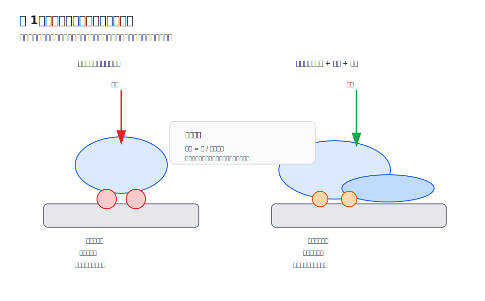
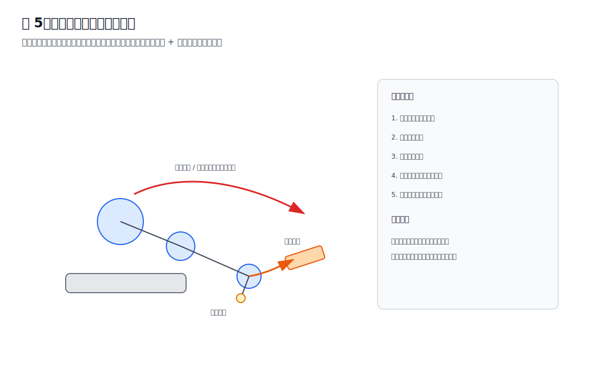
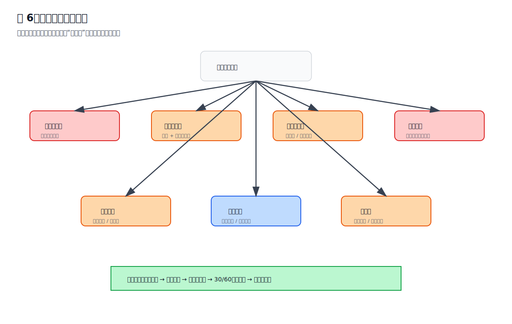
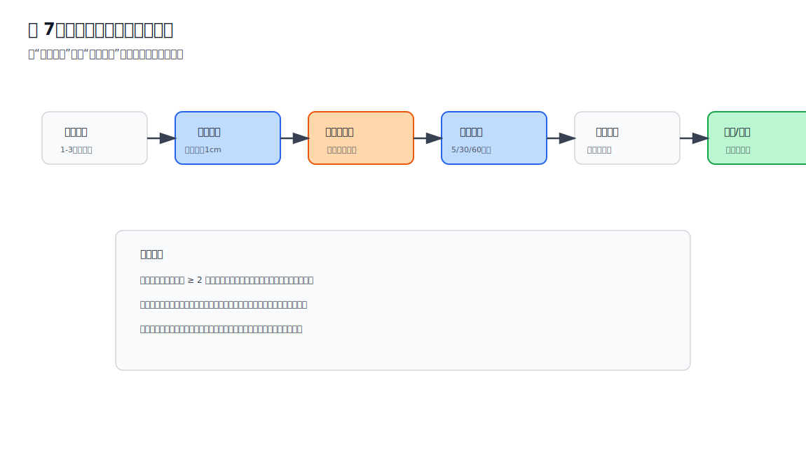

# 插图索引

本页面列出当前项目已有 SVG 插图及推荐引用位置。

---

## 01 压力分布示意图

文件：

```text
assets/diagrams/svg/01_pressure_distribution.svg
```

预览：



推荐章节：

- 第一章 驾驶为什么会让人疼
- 第九章 实验系统与量化记录

引用：

```markdown

```

---

## 02 骨盆三姿态受力图

文件：

```text
assets/diagrams/svg/02_pelvis_postures.svg
```

预览：


推荐章节：

- 第二章 骨盆决定受力

引用：

```markdown

```

---

## 03 Model 3 坐垫俯视结构图

文件：

```text
assets/diagrams/svg/03_model3_seat_top_view.svg
```

预览：


推荐章节：

- 第四章 Tesla Model 3 座椅结构分析
- 第七章 症状决策树

引用：

```markdown

```

---

## 04 座椅高度变化受力图

文件：

```text
assets/diagrams/svg/04_seat_height_force_change.svg
```

预览：


推荐章节：

- 第四章 Tesla Model 3 座椅结构分析
- 第五章 座椅调节流程

引用：

```markdown

```

---

## 05 右腿踩油门动态负荷链

文件：

```text
assets/diagrams/svg/05_pedal_dynamic_load_chain.svg
```

预览：



推荐章节：

- 第六章 踏板几何与右腿疲劳

引用：

```markdown

```

---

## 06 症状快速决策总览

文件：

```text
assets/diagrams/svg/06_symptom_decision_overview.svg
```

预览：



推荐章节：

- 第七章 症状决策树
- docs/quick_diagnosis_table.md

引用：

```markdown

```

---

## 07 座椅调整工程实验流程

文件：

```text
assets/diagrams/svg/07_experiment_system_flow.svg
```

预览：



推荐章节：

- 第九章 实验系统与量化记录
- docs/experiment_system.md

引用：

```markdown

```

---

## 08 车座、办公椅、身体状态三角模型

文件：

```text
assets/diagrams/svg/08_rehab_office_triangle.svg
```

预览：


推荐章节：

- 第八章 康复与办公椅联动

引用：

```markdown

```
