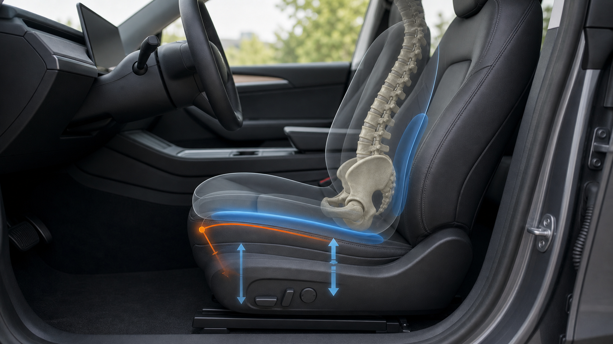
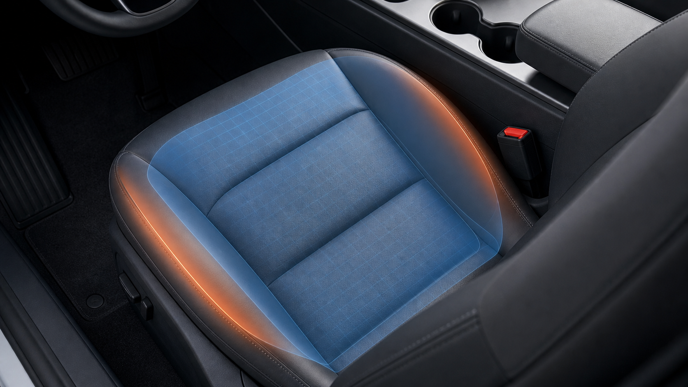
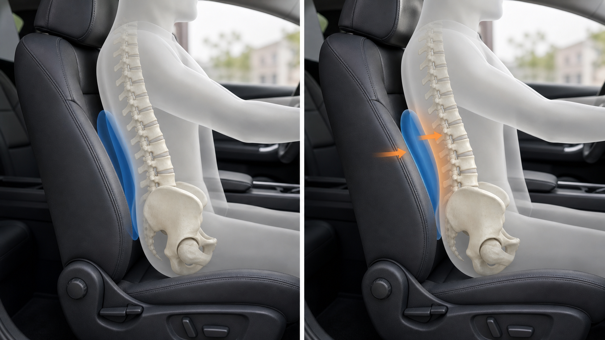
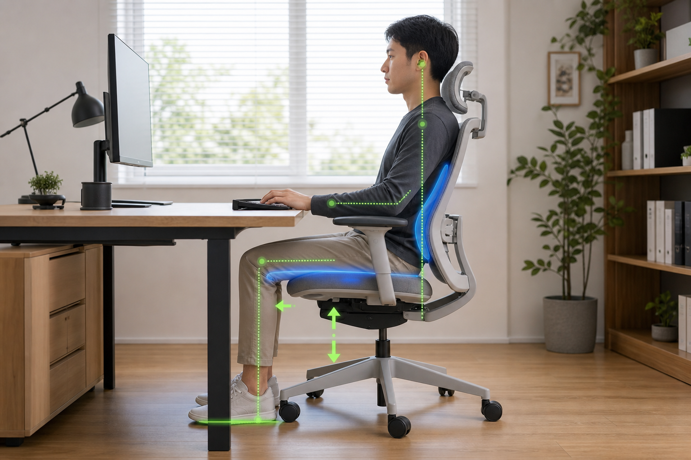
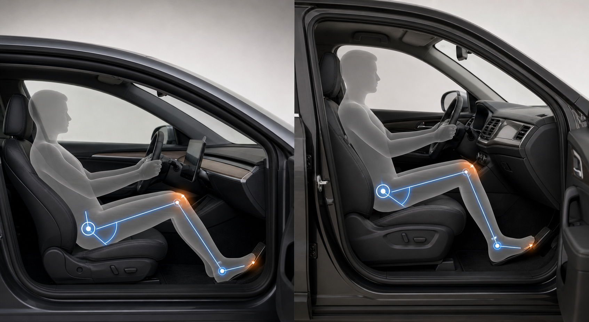
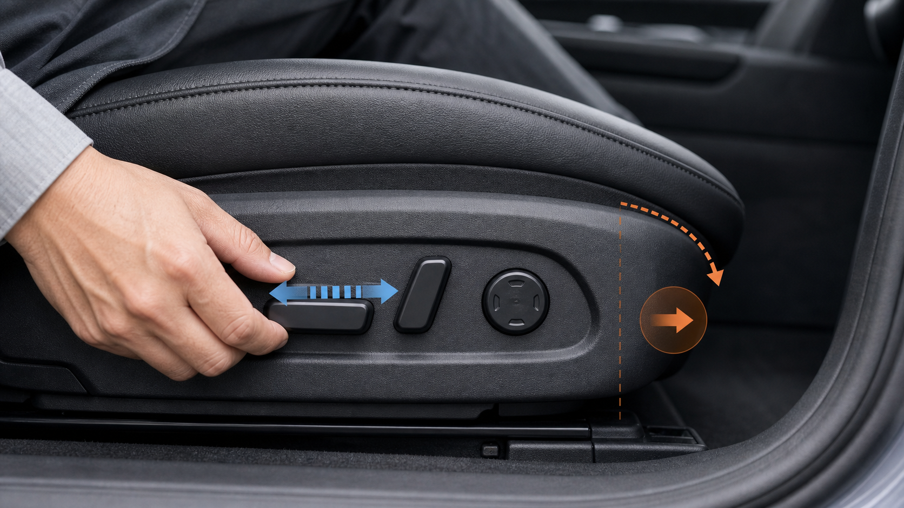

# 插图索引

本页面列出当前项目已有 SVG 插图及推荐引用位置。

---

## 01 压力分布示意图

文件：

```text
assets/diagrams/svg/01_pressure_distribution.svg
```

预览：


推荐章节：

- 第一章 驾驶为什么会让人疼
- 第九章 实验系统与量化记录

引用：

```markdown

```

---

## 02 骨盆三姿态受力图

文件：

```text
assets/diagrams/svg/02_pelvis_postures.svg
```

预览：


推荐章节：

- 第二章 骨盆决定受力

引用：

```markdown

```

---

## 03 Model 3 坐垫俯视结构图

文件：

```text
assets/diagrams/svg/03_model3_seat_top_view.svg
```

预览：


推荐章节：

- 第四章 Tesla Model 3 座椅结构分析
- 第七章 症状决策树

引用：

```markdown

```

---

## 04 座椅高度变化受力图

文件：

```text
assets/diagrams/svg/04_seat_height_force_change.svg
```

预览：


推荐章节：

- 第四章 Tesla Model 3 座椅结构分析
- 第五章 座椅调节流程

引用：

```markdown

```

---

## 05 右腿踩油门动态负荷链

文件：

```text
assets/diagrams/svg/05_pedal_dynamic_load_chain.svg
```

预览：


推荐章节：

- 第六章 踏板几何与右腿疲劳

引用：

```markdown

```

---

## 06 症状快速决策总览

文件：

```text
assets/diagrams/svg/06_symptom_decision_overview.svg
```

预览：


推荐章节：

- 第七章 症状决策树
- docs/quick_diagnosis_table.md

引用：

```markdown

```

---

## 07 座椅调整工程实验流程

文件：

```text
assets/diagrams/svg/07_experiment_system_flow.svg
```

预览：


推荐章节：

- 第九章 实验系统与量化记录
- docs/experiment_system.md

引用：

```markdown

```

---

## 08 车座、办公椅、身体状态三角模型

文件：

```text
assets/diagrams/svg/08_rehab_office_triangle.svg
```

预览：


推荐章节：

- 第八章 康复与办公椅联动

引用：

```markdown

```

---

# 真实感图片索引

真实感图片用于帮助读者把抽象受力关系放回车内、办公和身体活动场景。它们不替代 SVG 受力图，而是作为章节开头或关键小节的视觉引导。

## R01 真实感座椅压力分布

文件：

```text
assets/images/realistic/01_realistic_pressure_distribution.png
```

预览：


推荐章节：

- 第一章 驾驶为什么会让人疼
- 第三章 坐骨与软组织受力

---

## R02 真实感骨盆姿态对比

文件：

```text
assets/images/realistic/02_realistic_pelvis_postures.png
```

预览：


推荐章节：

- 第二章 骨盆决定受力
- 第五章 座椅调节流程

---

## R03 真实感右腿踏板负荷链

文件：

```text
assets/images/realistic/03_realistic_pedal_load_chain.png
```

预览：


推荐章节：

- 第六章 踏板几何与右腿疲劳

---

## R04 真实感车座办公椅身体状态联动

文件：

```text
assets/images/realistic/04_realistic_seat_office_body_triangle.png
```

预览：


推荐章节：

- 第八章 康复与办公椅联动
- docs/office_chair_checklist.md

---

## R05 真实感座椅高度调节

文件：

```text
assets/images/realistic/05_realistic_seat_height_adjustment.png
```

预览：



推荐章节：

- 第五章 座椅调节流程
- 第四章 Tesla Model 3 座椅结构分析

---

## R06 真实感坐垫侧翼与软组织挤压

文件：

```text
assets/images/realistic/06_realistic_side_bolster_pressure.png
```

预览：



推荐章节：

- 第四章 Tesla Model 3 座椅结构分析
- docs/case_library.md

---

## R07 真实感腰托支撑

文件：

```text
assets/images/realistic/07_realistic_lumbar_support.png
```

预览：



推荐章节：

- 第五章 座椅调节流程
- docs/case_library.md

---

## R08 真实感长途驾驶休息

文件：

```text
assets/images/realistic/08_realistic_long_drive_break.png
```

预览：


推荐章节：

- docs/case_library.md
- 第九章 实验系统与量化记录

---

## R09 真实感办公椅检查

文件：

```text
assets/images/realistic/09_realistic_office_chair_setup.png
```

预览：



推荐章节：

- docs/office_chair_checklist.md
- 第八章 康复与办公椅联动

---

## R10 真实感实验记录仪表盘

文件：

```text
assets/images/realistic/10_realistic_experiment_dashboard.png
```

预览：


推荐章节：

- 第九章 实验系统与量化记录
- docs/experiment_system.md

---

## R11 真实感车型坐姿几何对比

文件：

```text
assets/images/realistic/11_realistic_vehicle_geometry_comparison.png
```

预览：



推荐章节：

- docs/model_y_and_other_cars.md
- 第四章 Tesla Model 3 座椅结构分析

---

## R12 真实感社区案例收集

文件：

```text
assets/images/realistic/12_realistic_community_case_collection.png
```

预览：


推荐章节：

- docs/case_library.md
- 第十一章 GitHub Pages 发布与项目运营

---

## R13 真实感座椅调节按钮

文件：

```text
assets/images/realistic/13_realistic_seat_adjustment_controls.png
```

预览：



推荐章节：

- 第五章 座椅调节流程
- 第九章 实验系统与量化记录
