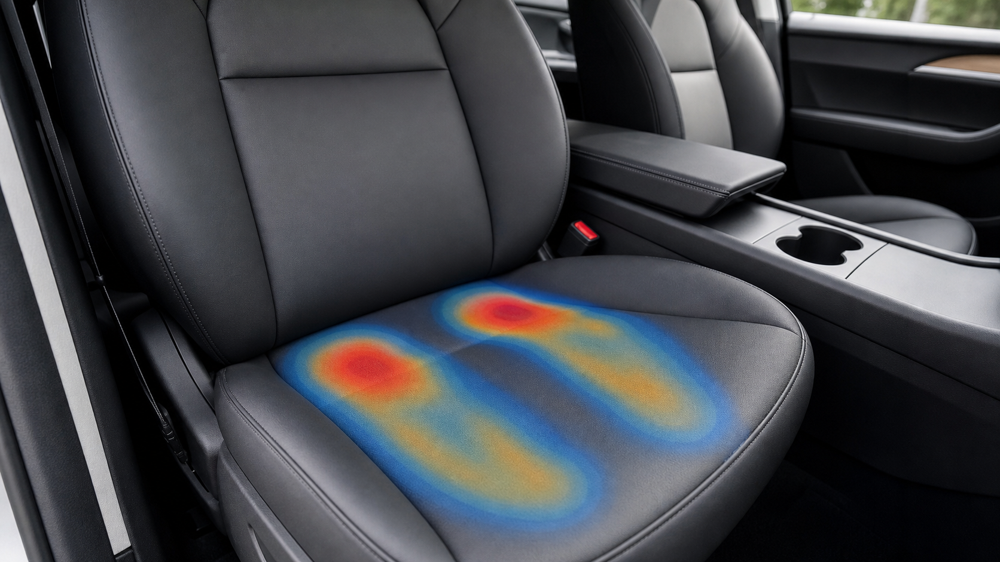

# 视觉风格指南

本指南用于统一项目中的所有 SVG 插图、真实感教育图片、流程图和趋势图。

---

## 1. 图形定位

本项目插图属于：

```text
人体工程学科普图
+
工程受力分析图
+
调整决策流程图
```

不是医学诊断图，也不是营销海报。

目标是：

- 清晰；
- 可复用；
- 能被 Git 版本管理；
- 能直接嵌入 MkDocs；
- 方便后续修改。

---

## 2. 颜色规范

| 用途 | 推荐颜色 | 说明 |
|---|---|---|
| 座椅 / 中性结构 | #e5e7eb | 灰色 |
| 正常压力 / 承托 | #bfdbfe | 蓝色 |
| 观察压力 / 偏高 | #fed7aa | 橙色 |
| 风险压迫 / 回退 | #fecaca | 红色 |
| 改善方向 / 推荐 | #bbf7d0 | 绿色 |
| 骨性结构 / 坐骨 | #fef3c7 | 黄色 |
| 主文字 | #111827 | 深灰 |
| 次级文字 | #374151 | 灰黑 |

---

## 3. 箭头规范

| 箭头 | 含义 |
|---|---|
| 灰色箭头 | 普通力线或流程 |
| 绿色箭头 | 改善方向 |
| 橙色箭头 | 压力增加或观察方向 |
| 红色箭头 | 风险方向 |

---

## 4. 标签规范

所有标签应尽量使用中文，避免过多英文术语。

推荐：

```text
坐骨
大腿后侧
坐骨两侧软组织
座椅前沿
脚跟支点
右腿动态负荷
峰值压强
```

不推荐：

```text
IT pain
sciatica confirmed
injury
disease
```

---

## 5. 风险表达规范

不要使用确定性医学判断。

推荐：

```text
麻刺风险
神经血管受压风险
需要回退
建议专业评估
```

避免：

```text
坐骨神经痛
神经损伤
必须治疗
已经压坏
```

---

## 6. 文件命名规范

```text
两位编号_英文主题.svg
```

示例：

```text
01_pressure_distribution.svg
02_pelvis_postures.svg
03_model3_seat_top_view.svg
```

---

## 7. 图文配合规范

每张图在正文中应配三部分：

1. 图前说明：这张图要解释什么；
2. 图片；
3. 图后结论：读者应该记住什么。

示例：

```markdown
下图说明，座椅调整不会让压力消失，只会改变压力分布。


结论：合理调整的目标不是“无压力”，而是降低局部峰值压强。
```

---

## 8. 真实感教育图片规范

真实感图片的作用是让读者把抽象机制放回真实场景。它们适合用在章节开头、核心概念转场和案例说明中。

推荐使用场景：

- 驾驶座压力分布；
- 骨盆姿态与靠背关系；
- 右脚踏板控制；
- 办公椅与身体状态联动；
- 长途驾驶和日常久坐场景。

真实感图片必须遵守：

- 不出现品牌 Logo；
- 不使用恐吓式疼痛视觉；
- 不出现医学诊断结论；
- 不用图片内文字承担解释任务；
- 图前和图后必须有正文说明；
- 与 SVG 图互补，而不是替代精确受力图。

文件命名：

```text
assets/images/realistic/两位编号_realistic_英文主题.png
```

示例：

```text
01_realistic_pressure_distribution.png
02_realistic_pelvis_postures.png
03_realistic_pedal_load_chain.png
04_realistic_seat_office_body_triangle.png
05_realistic_seat_height_adjustment.png
06_realistic_side_bolster_pressure.png
07_realistic_lumbar_support.png
08_realistic_long_drive_break.png
09_realistic_office_chair_setup.png
10_realistic_experiment_dashboard.png
11_realistic_vehicle_geometry_comparison.png
12_realistic_community_case_collection.png
13_realistic_seat_adjustment_controls.png
```

使用方式：

```markdown
下图把压力分布放回真实座椅场景，帮助理解峰值压强和接触面积的区别。



结论：真实感图用于建立直觉，具体变量判断仍以正文和 SVG 受力图为准。
```

---

## 9. 不推荐的图形风格

避免：

- 大量渐变；
- 复杂背景；
- 过度拟真；
- 过多文字堆叠；
- 红色恐吓式疼痛区域；
- 低分辨率截图；
- 文件名含空格或中文。

---

## 10. 推荐图形风格

推荐：

- 白底；
- 清晰线条；
- 少量颜色；
- 中文标签；
- 一个图只讲一个核心结论；
- 能在手机屏幕上看清；
- 能在 GitHub Markdown 中直接显示。
