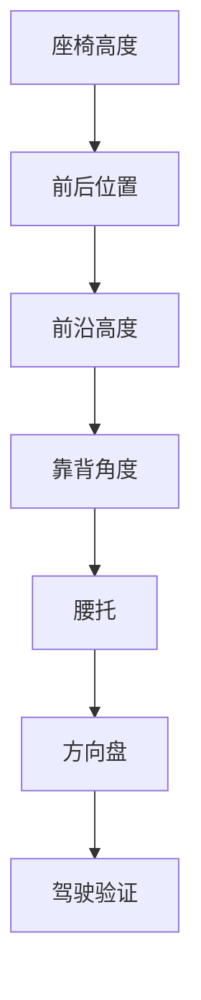

# 前言：驾驶舒适性不是玄学，而是受力问题

很多车主在调整驾驶座椅时，会陷入一个循环：

> 坐骨疼，就调高；  
> 大腿压，就调低；  
> 腰不舒服，就调靠背；  
> 右腿累，就调前后；  
> 今天舒服，明天又不舒服。

这种反复调整的根本原因，不是车主“太敏感”，也不是座椅一定“设计失败”，而是大多数人并没有真正理解一件事：

> **所有座椅调整，本质上都是在重新分配身体重量。**

身体重量不会凭空消失。调高、调低、前移、后移、抬高前沿、调直靠背，这些动作只是改变重量在臀部、坐骨、大腿、腰背和脚部之间的分配比例。真正决定舒适性的，不是某个部位有没有承重，而是：

- 承重是否集中；
- 接触面积是否足够；
- 峰值压强是否过高；
- 骨盆是否处在合理姿态；
- 肌肉和神经是否被持续牵拉或压迫；
- 驾驶动作是否导致左右受力不对称。

这本书试图把这些问题系统讲清楚。

## 为什么选择 Tesla Model 3

Tesla Model 3 是一辆很有代表性的车。它的座椅不像传统豪华车那样厚软，也不像赛车座椅那样强包裹，而是介于日常舒适、低坐姿、简洁内饰和电动车踏板布局之间。

它的特点包括：

- 坐姿相对低；
- 坐垫支撑直接；
- 踏板布局让右腿长时间参与控制；
- 座椅侧翼有一定包裹；
- 前沿、高度、靠背和腰托的组合变化非常影响体感。

这些特点让 Model 3 成为一个很好的人体工程学观察样本。

## 本书不做什么

本书不承诺给出一个“所有人都舒服”的标准座椅位置。原因很简单：

- 身高不同；
- 腿长不同；
- 骨盆姿态不同；
- 肌肉紧张程度不同；
- 既往久坐习惯不同；
- 对压迫、牵拉、麻刺的敏感程度不同。

因此，本书更关注“机制”而不是“答案”。

## 本书要做什么

本书希望建立一套可复用的分析方法：

1. 先判断不适属于压力集中、肌肉牵拉、神经压迫，还是操作姿势导致的动态负荷；
2. 再判断对应的座椅变量：高度、前后、前沿、靠背、腰托、方向盘；
3. 每次只调整一个变量；
4. 用 30 / 60 / 90 分钟驾驶反馈验证；
5. 把结果记录下来，形成可迭代的个人驾驶人体工程学档案。

## 重要提醒

坐骨承重本身是正常的。真正有问题的是：

- 坐骨某一个点持续压痛；
- 大腿后侧出现麻、刺、过电感；
- 症状离车后仍持续；
- 疼痛沿大腿向小腿放射；
- 伴随无力、感觉异常或夜间痛。

如果出现这些情况，应及时咨询医生或物理治疗师。


---

# 第一章 驾驶为什么会让人疼

## 1.1 坐着不是休息，而是一种静态负荷

很多人以为坐着是一种休息状态。实际上，从人体工程学角度看，坐姿并不是“没有负荷”，而是把站立时由双腿承担的部分重量，转移到了骨盆、臀部、大腿和靠背上。

站立时，身体重量主要通过：

```text
头部 / 躯干
   ↓
骨盆
   ↓
髋关节
   ↓
大腿
   ↓
小腿
   ↓
足底
   ↓
地面
```

而坐下后，传力路径变成：

```text
头部 / 躯干
   ↓
脊柱
   ↓
骨盆
   ↓
坐骨 + 臀部软组织 + 大腿后侧
   ↓
座椅
```

这意味着，坐姿并没有让重量消失，只是改变了重量的出口。

驾驶坐姿比普通办公坐姿更复杂。因为驾驶时不是静态坐在椅子上，而是同时存在三个约束：

1. 臀部和大腿要承重；
2. 右脚要持续控制油门和刹车；
3. 双手和上身要与方向盘保持稳定距离。

这三个约束叠加后，驾驶者很容易出现某些区域长期受压或持续紧张。

## 1.2 压力不会消失，只会重新分配

调整座椅时，一个常见误解是：

> “我把座椅调到某个位置，就能让压力消失。”

这不可能。

身体重量是恒定的。座椅调整只能改变压力分布。例如：

```text
座椅较低：
坐骨压力 ↑
大腿承重 ↓
骨盆后倾风险 ↑

座椅适当升高：
坐骨峰值压力 ↓
大腿参与承重 ↑
接触面积 ↑

座椅过高：
大腿后侧压力 ↑
腘窝或神经受压风险 ↑
脚部控制负担 ↑
```

因此，正确目标不是“没有压力”，而是：

> **让压力落在更耐压、更适合承重的区域，并避免局部峰值压强过高。**

人体较适合承重的区域包括：

- 臀大肌覆盖区域；
- 坐骨结节正下方；
- 大腿后侧较宽区域；
- 靠背支撑下的胸背与腰背区域。

较不适合长期承重的区域包括：

- 尾骨附近；
- 坐骨后缘的薄软组织区域；
- 腘窝附近；
- 大腿后侧神经血管集中的局部点；
- 臀下褶皱被座椅边缘横向顶住的位置。

## 1.3 压强比重量更重要

很多座椅不适并不是因为总重量太大，而是因为单位面积承受的压力过高。

力学上可以简化为：

```text
压强 = 力 / 接触面积
```

同样的体重，如果接触面积很小，就会形成高压点；如果接触面积较大，峰值压强就会下降。

例如，同样是上半身重量压向座椅：

```text
集中模式：

    体重
     ↓
    ● 坐骨局部点
     ↑
接触面积小，峰值压强高

分散模式：

    体重
     ↓
████████████
臀部 + 坐骨 + 大腿后侧
接触面积大，峰值压强低
```

这解释了一个常见现象：

> 调整后“大腿压力更明显”，但“坐骨单点疼减少”。

这并不矛盾。因为压力感觉变明显，可能只是更多组织开始参与承重；而真正有害的局部峰值压强反而下降了。

因此，在判断座椅是否合理时，不能只问：

> “有没有压力？”

更应该问：

> “压力是否集中在一个小点？”  
> “压力是否伴随麻、刺、过电感？”  
> “压力是否随着驾驶时间持续加重？”  
> “压力是否离开座椅后迅速缓解？”

## 1.4 为什么坐着 20 到 30 分钟后才开始疼

很多人不是一坐下就疼，而是开车二三十分钟后才开始不舒服。这通常与软组织持续受压后的缺血、代谢堆积和神经敏感性上升有关。

可以把它理解成一个累积过程：

```text
低压分散状态：
压力较低 → 血流仍可通过 → 疲劳积累慢 → 很久才不舒服

高压集中状态：
压力集中 → 局部血流受限 → 代谢废物堆积 → 疼痛阈值被触发
```

因此，座椅调整是否有效，不能只看刚坐上去的感觉。刚坐上去舒服，不代表 60 分钟后仍然合理；刚坐上去有承托感，也不代表一定有害。

更可靠的评价时间点是：

- 上车后 5 分钟：初始适应；
- 20 到 30 分钟：软组织受压开始显现；
- 45 到 60 分钟：真实耐受性显现；
- 90 分钟以上：长途驾驶适配性显现。

## 1.5 驾驶为什么比办公更容易诱发右侧不适

驾驶和办公椅最大的不同，是右腿不是完全放松的。

在自动挡或电动车上，右脚要持续完成：

- 油门开度控制；
- 刹车切换；
- 脚跟支点稳定；
- 脚踝小幅屈伸；
- 大腿和髋部的方向控制。

因此，右腿不仅是承重组织，还是操作系统的一部分。尤其在 Tesla Model 3 这种电门响应比较直接的车型上，右脚通常需要保持更细腻的控制。

这会带来一个问题：

> 右侧大腿和臀部同时承担“静态压力”和“动态控制”。

左腿相对放松，右腿持续工作，久而久之就可能出现右侧更明显的：

- 大腿后侧紧硬；
- 臀下压迫；
- 坐骨侧边挤压；
- 髋部不对称；
- 小腿或脚踝疲劳。

这也是为什么有些驾驶者会感觉：

> “只要完全离开油门，右侧压力瞬间减轻。”

这说明不适并不完全来自座椅静态压迫，还可能来自右腿踩踏时造成的肌肉持续收缩和骨盆微小旋转。

## 1.6 坐骨承重是正常的，坐骨单点疼才是不合理的

很多人在出现坐骨不适后，会误以为：

> “是不是不应该让坐骨承重？”

不是。

坐骨结节本来就是坐姿下的重要承重点。真正的问题不是坐骨是否承重，而是：

- 压在坐骨哪个部位；
- 是否由两侧均匀承重；
- 是否有臀部和大腿一起分担；
- 是否形成硬币大小的单点疼痛；
- 是否伴随尾骨方向疼痛或大腿麻刺。

可以把坐骨受力分成三类：

```text
合理承重：
两块坐骨正下方有稳定承托，臀部和大腿一起分担。

压力集中：
某一侧坐骨出现小范围压痛点，接触面积不足。

错误位置：
压力偏向坐骨后缘或尾骨方向，常伴随骨盆后倾。
```

所以，一个好的座椅调整结果不是“感觉不到坐骨”，而是：

> 坐骨有存在感，但不是尖锐、局部、持续加重的疼痛。

## 1.7 第一章小结

驾驶疼痛不是单一原因造成的。它通常来自四类因素叠加：

1. **压力分布问题**：重量集中在坐骨、小腿或大腿某个局部点。
2. **骨盆姿态问题**：后倾、过度前倾或左右旋转导致受力偏移。
3. **肌肉张力问题**：腘绳肌、臀肌、髋屈肌紧张，让坐下时更容易产生压迫。
4. **操作负荷问题**：右脚控制油门和刹车，让右腿承担额外动态负荷。

因此，座椅调整的目标不是“调到完全没有感觉”，而是：

- 坐骨稳定但不尖锐；
- 臀部和大腿共同承重；
- 大腿有压力但不麻、不刺；
- 腰背被靠背接住但不被硬顶；
- 右脚控制踏板自然，不需要身体前探或大腿持续绷紧；
- 30 到 60 分钟后不适没有明显累积。

从下一章开始，我们进入真正的核心：骨盆。因为几乎所有坐姿受力问题，最后都会回到骨盆的位置。


---

# 第二章 骨盆决定受力

> 本章状态：提纲 + 部分草稿。后续需要补充插图、解剖示意和驾驶案例。

## 2.1 为什么骨盆是核心

驾驶坐姿中，骨盆是身体重量传递的中转站。

上半身重量先传到脊柱，再传到骨盆，最后通过坐骨、臀部和大腿传到座椅。骨盆角度一变，坐骨接触位置、腰椎曲度、大腿承重比例都会随之改变。

因此，同一张座椅、同一个高度，只要骨盆姿态不同，体感就会完全不同。

## 2.2 三种典型骨盆姿态

### 后倾

特征：

- 腰椎变平；
- 身体像窝在座椅里；
- 坐骨压力偏后；
- 尾骨方向压力增加；
- 大腿分担减少。

示意：

```text
骨盆后倾
  上身
   \
    \
     \__
坐骨后缘受力 ↑
尾骨方向风险 ↑
```

### 中立

特征：

- 腰椎有自然小弧；
- 坐骨正下方稳定承重；
- 臀部和大腿共同分担；
- 不需要刻意挺腰；
- 适合长时间驾驶。

示意：

```text
骨盆中立
  上身
   |
   |
 __|__
坐骨正下方承重
臀部 + 大腿分担
```

### 过度前倾

特征：

- 腰椎过度前凸；
- 腹部前顶；
- 髋前侧紧张；
- 腰背肌容易疲劳；
- 并不适合长期驾驶。

示意：

```text
骨盆过度前倾
  上身
    /
   /
__/ 
腰椎压力 ↑
髋前侧紧张 ↑
```

## 2.3 为什么“蜷缩在座椅里”不一定错误

驾驶时合理姿势不等于军姿。人体工程学坐姿应当允许身体被座椅支撑，肩背可以贴靠，腰部有自然支撑，骨盆稳定。

需要区分两种“蜷缩”：

### 合理包裹

- 腰背和肩部贴合靠背；
- 骨盆在座椅深处稳定；
- 坐骨正下方承重；
- 胸部自然放松；
- 不需要持续用力维持姿势。

### 错误塌陷

- 胸口塌；
- 下巴前伸；
- 腰椎完全变平；
- 骨盆明显后倾；
- 压力偏向坐骨后缘或尾骨。

判断关键不是外观看起来是否“直”，而是骨盆是否稳定、压力是否分散。

## 2.4 本章待补充

- 骨盆前后摇摆练习；
- 骨盆中立自测；
- 靠背角度对骨盆的影响；
- 腰托是“接住骨盆”，不是“硬顶腰”；
- Model 3 低坐姿下骨盆更容易后倾的机制。


---

# 第三章 坐骨与软组织受力

> 本章状态：章节提纲。后续补充完整正文。

## 3.1 坐骨不是一个点

坐骨结节是坐姿承重的重要骨性结构，但它不是针尖，而是一块有弧度的承重区域。骨盆角度不同，实际接触部位也不同。

## 3.2 合理坐骨承重

合理状态：

- 两侧坐骨都有稳定承重；
- 压力不是硬币大小单点；
- 臀部软组织一起参与；
- 大腿后侧有一定承托；
- 坐 30 到 60 分钟后不出现明显累积痛。

## 3.3 坐骨单点压痛

常见机制：

- 接触面积太小；
- 骨盆后倾导致压力偏后；
- 坐垫偏硬；
- 大腿没有参与分担；
- 左右骨盆不对称。

## 3.4 坐骨两侧软组织挤压

可能来源：

1. 座椅侧翼包裹；
2. 臀部软组织被座面和侧翼共同挤压；
3. 腘绳肌或臀肌紧张，使软组织张力升高；
4. 骨盆轻微后倾或左右旋转；
5. 驾驶时右腿持续操作踏板造成右侧额外负荷。

## 3.5 办公椅也有类似感觉说明什么

如果驾驶座和办公椅都有类似的坐骨两侧挤压、大腿后侧紧硬，说明问题可能不仅是车辆座椅几何，还可能与身体组织状态有关：

- 腘绳肌紧；
- 臀肌紧；
- 骨盆控制能力不足；
- 久坐耐受性下降。

## 3.6 本章待补充图

- 坐骨结节示意图；
- 坐骨后缘与尾骨方向压力图；
- 两侧软组织挤压横截面图；
- 坐骨压力热力图。


---

# 第四章 Tesla Model 3 座椅结构分析

> 本章状态：章节提纲。此章将成为本书重点章节。

## 4.1 Model 3 座椅为什么值得单独分析

Tesla Model 3 座椅具有较强代表性：

- 电动车低坐姿；
- 座椅支撑相对直接；
- 踏板响应敏感；
- 右腿需要持续细腻控制；
- 坐垫侧翼存在包裹；
- 方向盘和屏幕布局影响身体姿态。

## 4.2 坐垫结构

待分析：

- 坐垫后部承托；
- 坐垫前沿；
- 两侧侧翼；
- 坐垫硬度；
- 皮面摩擦力；
- 坐姿下身体是否容易前滑或后瘫。

## 4.3 座椅高度

核心变量：

- 髋膝相对高度；
- 大腿是否参与承重；
- 坐骨峰值压强；
- 踏板控制角度；
- 骨盆后倾风险。

## 4.4 前沿高度

前沿升高可能带来：

- 大腿后侧接触面积增加；
- 坐骨单点压力下降；
- 大腿根压力增强；
- 若过高，可能造成腘窝或大腿后侧神经血管压迫。

## 4.5 前后位置

后移 1 到 2 cm 可能带来：

- 大腿根压力下降；
- 压力向大腿中段移动；
- 膝关节角度变大；
- 踩踏板距离增加；
- 若过度后移，可能造成脚尖够踏板或身体前探。

## 4.6 靠背角度

靠背太躺：

- 身体容易后滑；
- 骨盆后倾增加；
- 坐骨后缘压力增加。

靠背太直：

- 腰背可能被迫持续用力；
- 胸背支撑不足；
- 肩颈紧张风险增加。

合理目标：

- 腰和肩能被靠背接住；
- 骨盆不后瘫；
- 不需要主动挺腰；
- 方向盘距离允许肩膀放松。

## 4.7 右腿为什么更容易累

待展开：

- 电门控制需要持续肌肉参与；
- 脚跟作为支点；
- 脚踝小幅屈伸；
- 大腿后侧和髋部稳定；
- 右侧骨盆轻微旋转或下沉。

## 4.8 本章待补充图

- Model 3 坐垫俯视结构图；
- 坐垫侧翼横截面图；
- 高度变化压力图；
- 前后位置变化力线图；
- 右腿踏板控制肌肉负荷图。


---

# 第五章 座椅调节流程

## 5.1 总原则：一次只调整一个变量

座椅调节最大的错误，是一次改太多：

- 高度改了；
- 前后也改了；
- 靠背也改了；
- 前沿也改了；
- 腰托也变了。

这样无法判断到底是哪一个变量产生了改善或副作用。

正确做法：

```text
一次只改一个变量
↓
连续驾驶 2 到 3 次
↓
记录 30 / 60 分钟反馈
↓
判断是否保留
```

## 5.2 推荐调节顺序

建议顺序：



原因：

1. 高度决定髋膝关系；
2. 前后决定踏板距离；
3. 前沿决定大腿承托；
4. 靠背决定骨盆和脊柱；
5. 腰托只能辅助，不能替代骨盆控制；
6. 方向盘决定上身是否需要前探。

## 5.3 当前案例中的微调方案

当前状态：

- 靠背较直；
- 腰和肩基本贴合靠背；
- 前沿已略微抬高；
- 坐骨单点疼痛减少；
- 大腿后侧紧硬；
- 坐骨两侧软组织仍有挤压；
- 办公椅也有类似感觉。

基于该状态，建议验证：

```text
第一步：座椅整体升高约 1 cm
↓
观察坐骨两侧软组织挤压是否下降
↓
第二步：若大腿根或大腿后侧仍紧，再后移约 1 cm
↓
观察大腿后侧紧硬是否缓解
```

## 5.4 为什么先升高 1 cm

轻微升高可能带来：

- 髋部位置略升；
- 骨盆更容易保持中立；
- 大腿参与承重更充分；
- 坐骨两侧软组织峰值压力下降。

但风险是：

- 大腿后侧压力可能增加；
- 若脚部控制变差，说明升高过多；
- 若出现麻刺，需要回退。

## 5.5 为什么再后移 1 cm

后移主要改变腿部几何关系：

- 腿相对伸展；
- 大腿根压力可能下降；
- 压力从臀下向大腿中段迁移；
- 腘绳肌持续紧张可能减轻。

但风险是：

- 踩刹车到底时膝盖不能过直；
- 身体不能为了够方向盘而前探；
- 右脚不能只用脚尖够踏板。

## 5.6 验证标准

每次调整后，至少记录：

| 指标 | 5分钟 | 30分钟 | 60分钟 |
|---|---:|---:|---:|
| 坐骨单点疼 | 0-10 | 0-10 | 0-10 |
| 坐骨两侧挤压 | 0-10 | 0-10 | 0-10 |
| 大腿后侧紧硬 | 0-10 | 0-10 | 0-10 |
| 大腿根压力 | 0-10 | 0-10 | 0-10 |
| 右腿踩油门疲劳 | 0-10 | 0-10 | 0-10 |
| 腰背支撑感 | 0-10 | 0-10 | 0-10 |

## 5.7 需要立即回退的信号

出现以下情况时，不建议继续坚持：

- 麻木；
- 针刺；
- 过电感；
- 疼痛沿大腿向小腿放射；
- 踩刹车时腿几乎伸直；
- 身体需要明显前探；
- 离车后症状持续不缓解。
